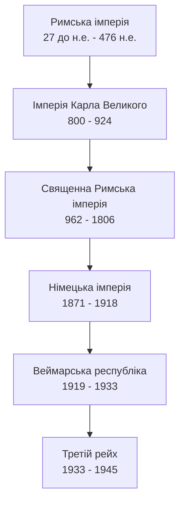
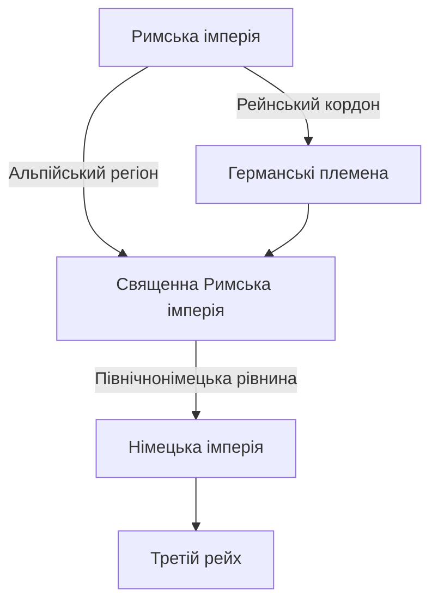
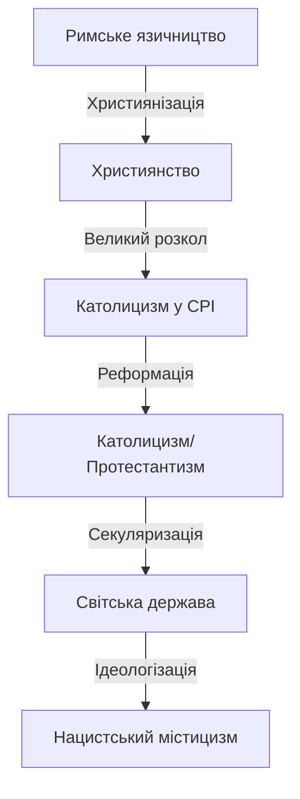

## Історія Римських імперій та Германських рейхів

```table-of-contents
```
## Хронологічна послідовність імперій

### Еволюція імперій

27 до н.е. : Римська імперія
476 : Падіння Західної Римської імперії
800 : Імперія Карла Великого
962 : Священна Римська імперія
1806 : Кінець Священної Римської імперії
1871 : Німецька імперія (Другий рейх)
1919 : Веймарська республіка
1933 : Третій рейх
1945 : Кінець Третього рейху



## Римська імперія (27 до н.е. - 476 н.е.)

**Час виникнення:** 27 рік до н.е., коли Октавіан отримав титул Августа.

**Основні характеристики:**
- Принципат як форма правління
- Розвинена правова система
- Територіальна експансія
- Релігійний синкретизм

**Поділ імперії:**
- 285 р.: Діоклетіан розділяє управління
- 395 р.: Остаточний поділ на Західну та Східну імперії

### Криза III століття та реформи Діоклетіана

- Криза 235-284 років:
  - Військова анархія
  - Економічний колапс
  - Епідемії та демографічний спад

- Реформи Діоклетіана:
  - Тетрархія як система управління
  - Адміністративна реформа провінцій
  - Податкова реформа
  - Військова реорганізація

**Вплив на подальшу історію:**
- Модель розділеного управління
- Прецедент християнських переслідувань
- Бюрократична система

## Священна Римська імперія (962-1806)

**Час виникнення:** Коронація Оттона I в 962 році.

**Структура влади:**
- Виборна монархія
- Імперський сейм
- Курфюрсти
- Золота булла 1356 року

**Релігійний аспект:**
- Тісний зв'язок з католицькою церквою
- Реформація та релігійні війни
- Вестфальський мир 1648 року

## Порівняльна таблиця імперій

| **Характеристика** | **Римська імперія**     | **Священна Римська імперія** | **Німецька імперія**   | **Третій рейх**      |
| ------------------ | ----------------------- | ---------------------------- | ---------------------- | -------------------- |
| Період             | 27 до н.е. - 476        | 962-1806                     | 1871-1918              | 1933-1945            |
| Столиця            | Рим                     | Різні міста                  | Берлін                 | Берлін               |
| Форма правління    | Принципат/домінат       | Виборна монархія             | Конституційна монархія | Диктатура            |
| Релігія            | Язичництво/християнство | Католицизм/протестантизм     | Світська держава       | Нацистська ідеологія |
### Реформація та її наслідки

- Аугсбурзький релігійний мир 1555:
  - Принцип "cuius regio, eius religio"
  - Територіальна фрагментація
  - Посилення князівської влади

- Тридцятилітня війна (1618-1648):
  - Релігійні та політичні причини
  - Залучення європейських держав
  - Вестфальська система міжнародних відносин

**Наслідки для імперської структури:**
- Децентралізація влади
- Релігійний плюралізм
- Ослаблення імператорської влади

## Географічні впливи



## Культурні впливи та спадщина

### Римська спадщина
- Латинська мова в адміністрації
- Римське право
- Імперська символіка
- Архітектурні традиції

### Германська спадщина
- Феодальна система
- Племінне право
- Військові традиції
- Культурна ідентичність

### Імперська ідея та її трансформація

- Концепція translatio imperii:
  - Передача імперської влади
  - Легітимізація правління
  - Спадкоємність від Риму

- Еволюція імперської ідеї:
  - Середньовічний універсалізм
  - Національна держава
  - Расова теорія

**Вплив на державотворення:**
- Централізація влади
- Територіальна експансія
- Політична міфологія

## Релігійні трансформації



## Висновки

Історичний шлях від Римської імперії до Третього рейху демонструє складну еволюцію державності в Центральній Європі. Кожна імперія успадковувала елементи попередніх, адаптуючи їх до нових історичних умов. Релігійні та культурні трансформації відігравали ключову роль у цьому процесі.

<iframe title="Зліт і падіння Другого Райху. Шлях від величі до самогубства." src="https://www.youtube.com/embed/P067nvwqj5I?feature=oembed" height="113" width="200" style="aspect-ratio: 1.76991 / 1; width: 100%; height: 100%;" allowfullscreen="" allow="fullscreen"></iframe>

#Історія #Факти

[[Скандинавские и германские боги и их символы]]
[[Соответствия греческого и римского пантеонов]]
[[Історія республік Франції]]
[[Історія Японії. Епохи, релігії, впливові клани та самобутній дух]]