# Історія Японії: Епохи, релігії, впливові клани та самобутній дух

```table-of-contents
title: ## Зміст
minLevel: 2
maxLevel: 3
```

## Синто-буддійський синкретизм

### Формування державної ідеології
- **Синтоїзм як основа імператорської влади**
  - Концепція "акіцу-міками" (現御神) - живого божества в особі імператора
  - Роль святилища Ісе як духовного центру імператорського дому
  - Формування міфологічної генеалогії через Кодзікі та Ніхон Шьокі

- **Інтеграція буддизму**
  - Концепція "хонджі суйджяку" (本地垂迹) - будди як прояви камі
  - Створення системи "джінґуджі" (神宮寺) - храмів-святилищ
  - Роль буддійських монастирів у легітимізації влади

## Релігійні інститути та управління державою

### Буддійські монастирі як центри влади
- **Економічна база**
  - Система "шьоен" (荘園) - монастирські землеволодіння
  - Податкові привілеї та імунітети
  - Контроль над торговими шляхами

- **Військова міць**
  - "Сохей" (僧兵) - монастирські воїни
  - Фортифікаційні споруди монастирів
  - Альянси з місцевими самурайськими кланами

### Взаємодія з політичною владою
- **Період Нара**
  - Система державних храмів "кокубунджі" (国分寺)
  - Роль монастирів у державному управлінні
  - Вплив буддійського духовенства на імператорський двір

- **Період Хейан**
  - Протистояння Енрякуджі та інших великих монастирів
  - Езотеричний буддизм як інструмент політичного впливу
  - Формування системи храмових комплексів

## Даймьо та система управління

### Визначення та еволюція інституту даймьо
Даймьо (大名, дослівно "велике ім'я") - це феодальні правителі Японії, які контролювали окремі території (хан) та мали власні армії. Інститут даймьо пройшов кілька етапів розвитку:

1. **Шюґо-даймьо** (守護大名, період Муроматі)
   - Призначені сьоґуном військові губернатори
   - Поступове перетворення на спадкових правителів
   - Контроль над податками та судочинством

2. **Сенґоку-даймьо** (戦国大名, період Сенґоку)
   - Незалежні військові правителі
   - Пряме управління територією
   - Власна адміністративна система

3. **Кінсей-даймьо** (近世大名, період Едо)
   - Інтегровані в систему сьоґунату
   - Обмежені системою санкін-котай
   - Стандартизоване управління доменом

### Адміністративна система даймьо
- **Структура управління доменом**
  - Караро (家老) - старші радники
  - Йорікі (与力) - середня адміністрація
  - Ашіґару (足軽) - нижчі самураї

- **Економічна організація**
  - Система кокудака (石高) - оцінка доходів у коку рису
  - Управління самурайськими стипендіями
  - Розвиток місцевої промисловості

## Розвиток та трансформація сьоґунату

## Становлення системи сьоґунату

### Передумови виникнення
- **Ослаблення імператорської влади**
  - Система інсей (院政) - правління імператорів у відставці
  - Домінування регентів Фудзівара
  - Зростання впливу провінційних військових лідерів

- **Військова аристократія**
  - Формування стану буші (武士)
  - Система васальної залежності
  - Кодекс бушідо (武士道)

### Структура військового правління

1. **Камакура бакуфу (1185-1333)**
   - **Інновації в управлінні**
     * Система ґокенін (御家人) - прямих васалів
     * Хьоджьошю (評定衆) - вища рада
     * Мандокоро (政所) - адміністративна палата

   - **Особливості влади**
     * Двоїста система влади (імператор у Кіото, сьоґун у Камакурі)
     * Регентство роду Ходжьо
     * Розвиток самурайського правосуддя

2. **Муроматі бакуфу (1336-1573)**
   - **Адміністративні інновації**
     * Система шюґо (守護) - військових губернаторів
     * Канрей (管領) - вища посада при сьоґуні
     * Інтеграція придворної та військової аристократії

   - **Територіальне управління**
     * Автономія даймьо
     * Система джіто (地頭) - земельних управителів
     * Розвиток міського самоврядування

3. **Едо бакуфу (1603-1867)**
   - **Централізована система**
     * Санкін-котай (参勤交代) - система заручників
     * Родзю (老中) - рада старійшин
     * Омецуке (大目付) - система інспекторів

   - **Соціальний контроль**
     * Сі-но-ко-шьо (士農工商) - станова система
     * Мібун (身分) - система соціальних статусів
     * Регламентація побуту та поведінки

## Економічні інституції феодальної та модерної Японії

### Дзайбацу (財閥) - промислово-фінансові конгломерати
Дзайбацу - це унікальна форма бізнес-конгломератів, що виникла в період Мейджі та домінувала в японській економіці до 1945 року.

1. **Структура дзайбацу**
   - **Організаційна ієрархія**
     * Хонша (本社) - головна холдингова компанія
     * Коґайша (子会社) - дочірні компанії
     * Система перехресного володіння акціями

   - **Сімейний контроль**
     * Доміко (同族) - сімейна рада
     * Спадкове керівництво
     * Закрита система найму

2. **Найбільші дзайбацу**
   - **Міцуї**
     * Походження від торгового дому періоду Едо
     * Диверсифікація в банківську справу та промисловість
     * Інновації в роздрібній торгівлі

   - **Міцубіші**
     * Заснування в період Мейджі
     * Фокус на важкій промисловості
     * Розвиток морського транспорту

   - **Сумітомо**
     * Витоки в мідній промисловості
     * Розширення в банківський сектор
     * Технологічні інновації

### Кейрецу (系列) - післявоєнні бізнес-групи
Кейрецу прийшли на зміну дзайбацу після їх розформування американською окупаційною владою.

1. **Відмінності від дзайбацу**
   - Відсутність сімейного контролю
   - Горизонтальна інтеграція
   - Система основного банку

2. **Типи кейрецу**
   - **Горизонтальні**
     * Об'єднання різногалузевих компаній
     * Центральна роль банку
     * Система взаємного володіння акціями

   - **Вертикальні**
     * Виробничі піраміди
     * Довгострокові контракти
     * Технологічна інтеграція

## Міжнародні відносини

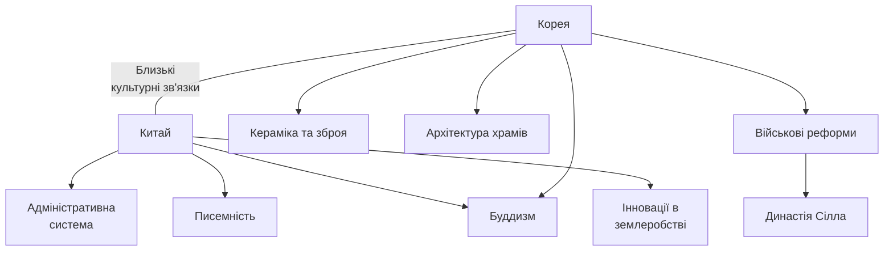

### Вплив Китаю
- **Буддизм**: Перенесення буддійських текстів та створення монастирів за китайським зразком.
- **Адміністративна система**: Впровадження китайської моделі централізованої бюрократії.
- **Культура**: Запозичення конфуціанських принципів та каліграфії.

### Вплив Кореї
- **Релігія**: Королівство Пекче допомогло розповсюдженню буддизму в Японії.
- **Технології**: Передача методів виготовлення зброї та броні.
- **Мистецтво**: Запровадження нових стилів у храмовій архітектурі та кераміці.
- **Політика**: Союзи під час війн проти інших корейських держав.

### Зв'язки через дипломатію
1. **Китайська династія Тан**:
   - Відправка японських місій для навчання державному управлінню.
   - Активна торгівля шовком і фарфором.

2. **Корея (Пекче, Сілла, Когурьо)**:
   - Культурний та технологічний міст між Китаєм та Японією.
   - Спільні військові дії або протистояння в різні періоди.

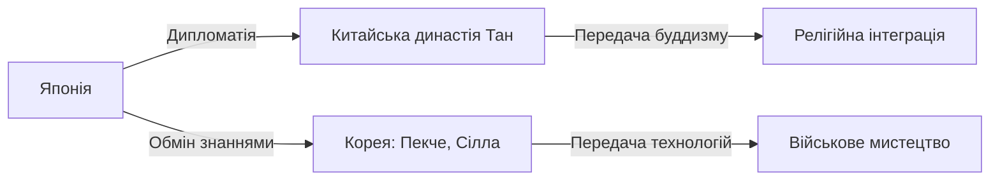

***
## Історичні епохи в Японії
## Принципи оголошення епох у Японії

Епохи в Японії називаються *нєнґо* (年号) або *ґенґо* (元号). Це система, за якою кожен період правління імператора має власну назву, що відображає ідеали, цілі чи дух часу. Основні принципи:
1. Зміна епохи оголошується під час:
   - Сходження нового імператора на трон.
   - Значущих змін у суспільстві або важливих подій.
2. Вибір назви:
   - Гасло епохи має виражати гармонію, процвітання чи стабільність.
   - Назви часто черпаються з китайської класичної літератури.
3. Затвердження:
   - Офіційно назву затверджує уряд за участі спеціалістів з історії та мови.

## Асука (538-710)
**Ненґо (年号):** "Тайка" (大化, "Велика зміна") - перше офіційне гасло епохи
### Передумови оголошення епохи та ненґо:
- Впровадження системи ненґо за китайським зразком
- Реформа Тайка як символ трансформації держави
- Потреба в легітимізації нової політичної системи

### Передумови оголошення епохи:
- Прийняття буддизму принцом Шьотоку в 538 році
- Об'єднання розрізнених кланів під владою імператорського двору
- Вплив китайської династії Суй та корейського королівства Пекче

### Імператори та їх особливості:
- **Кіммей** (539-571): перший, хто визнав буддизм
- **Бідацу** (572-585): сприяв поширенню континентальної культури
- **Йомей** (585-587): активно підтримував буддизм
- **Суйко** (593-628): перша імператриця Японії, співправила з принцом Шьотоку
- **Дзьомей** (629-641): розпочав будівництво буддійських храмів
- **Кōґьоку/Саймей** (642-661): правила двічі під різними іменами
- **Тендзі** (661-672): провів реформу Тайка

### Релігійний розвиток:
1. Буддизм:
   - Заснування перших храмів (Асука-дера, Шітеннō-дзі)
   - Формування шкіл Санрон та Дзьодзіцу
   - Поява перших буддійських монастирів

1. Синтоїзм:
   - Початок систематизації міфології
   - Формування концепції божественного походження імператорів
   - Взаємодія з буддизмом

### Політична боротьба та прийняття буддизму
- Клан Сога активно підтримував буддизм, розглядаючи його як засіб для централізації влади.
- Клан Мононобе, прихильник традиційного синтоїзму, виступав проти нової релігії, вважаючи її загрозою для японських традицій.
- Перемога Сога в 587 році (битва при Шигі) забезпечила офіційне визнання буддизму як державної релігії.

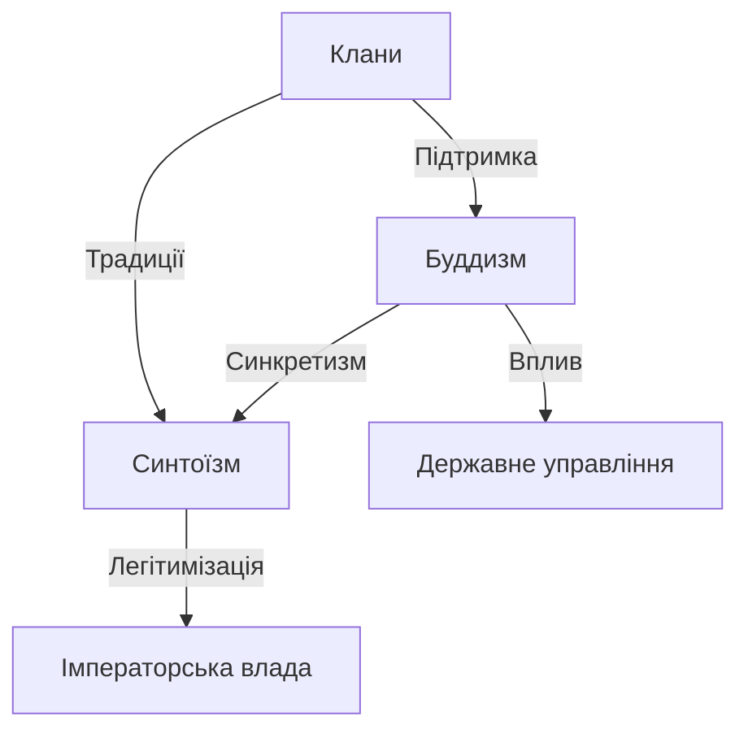

### Політичні реформи:
1. Реформа Тайка (645):
   - Введення системи ріцурьо
   - Централізація влади
   - Земельна реформа
   - Створення бюрократичного апарату

2. Кодекс Тайхо (701):
   - Встановлення правової системи
   - Регламентація державного управління
   - Визначення соціальної ієрархії

### Впливові клани та їх роль:
1. Сога:
   - Підтримка буддизму
   - Контроль над імператорським двором
   - Монополізація зовнішньої торгівлі

2. Мононобе:
   - Опозиція буддизму
   - Захист традиційних вірувань
   - Військова підтримка імператора

3. Накатомі:
   - Проведення синтоїстських ритуалів
   - Збереження традицій
   - Посередництво між імператором та ками

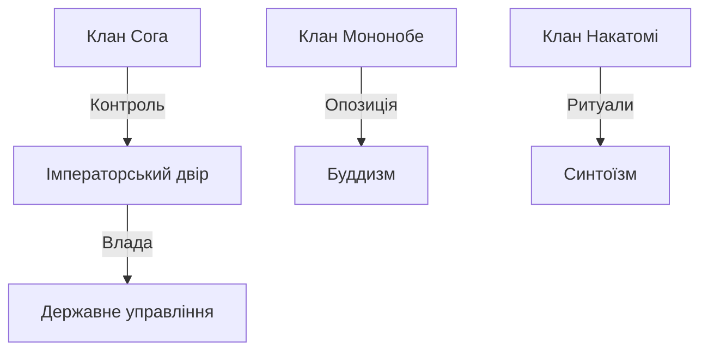

### Культурний розвиток:
1. Архітектура:
   - Будівництво перших буддійських храмів
   - Поява палацової архітектури
   - Вплив корейського стилю

2. Мистецтво:
   - Створення перших буддійських статуй
   - Розвиток настінного живопису
   - Поява придворної музики

3. Писемність:
   - Впровадження китайських ієрогліфів
   - Початок ведення хронік
   - Створення перших офіційних документів

### Міжнародні відносини:
1. Китай:
   - Дипломатичні місії
   - Культурний обмін
   - Запозичення адміністративної системи

2. Корея:
   - Технологічний обмін
   - Релігійний вплив
   - Торгові зв'язки

## Нара (710-794)
**Ненґо:** "Вадо" (和銅, "Японська мідь")
### Передумови оголошення епохи:
- Перенесення столиці до Хейдзьо-кьо (сучасна Нара)
- Завершення формування системи ріцурьо
- Консолідація буддійських інституцій

### Імператори та їх особливості:
- **Ґенмей** (707-715): заснувала столицю в Нарі
- **Ґеншьо** (715-724): перша передача трону за життя
- **Шьому** (724-749): збудував храм Тодайдзі
- **Кокен/Шьотоку** (749-770): правила двічі під різними іменами
- **Конін** (770-781): намагався обмежити вплив буддійських монастирів

### Видатні постаті:
  - *Фудзівара но Фухіто* — реформатор, укладач Кодексу Тайхо.
  - *Ґьокі* — буддійський монах, засновник соціальних проектів.

### Буддійські монастирі як політичний інструмент
- Храм Тодайдзі став не лише духовним центром, а й символом імператорської влади.
- Статуя Великого Будди в Тодайдзі була споруджена імператором Шьому як символ об'єднання країни під імператорською владою.
- Розвиток системи державних храмів "кокубунджі" (国分寺) створював мережу релігійних центрів, що підтримували центральну адміністрацію.

### Релігійний розвиток:
1. Буддійські школи:
   - Кеґон (華厳): філософська школа, зосереджена на храмі Тодайдзі
   - Хоссо (法相): вивчення природи свідомості
   - Ріссю (律宗): акцент на монастирській дисципліні
   - Санрон (三論): розвиток мадх'яміки

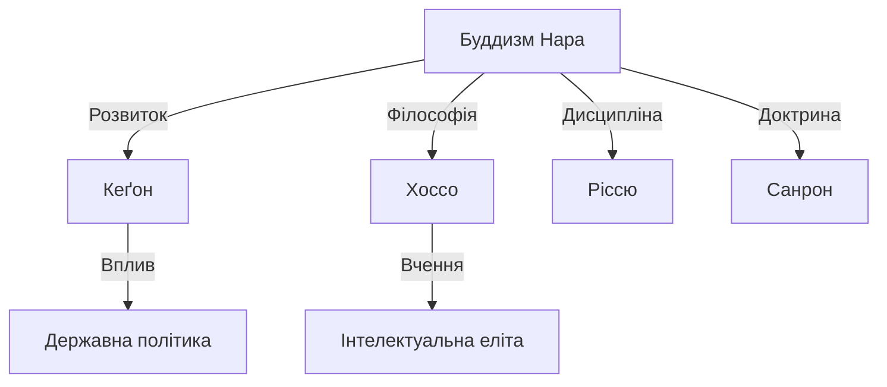

### Державне управління:
1. Система ріцурьо:
   - Кодекс Йоро (757)
   - Адміністративний поділ на провінції
   - Податкова система
   - Військова організація

2. Бюрократичний апарат:
   - Дайдзьокан (太政官): вища рада
   - Міністерства (шьо, 省)
   - Провінційні управління (кокуґа, 国衙)

### Економічний розвиток:
1. Земельна система:
   - Наділи (кубунден, 口分田)
   - Державні землі (коден, 公田)
   - Приватні володіння (шьоен, 荘園)

2. Торгівля:
   - Розвиток ринків
   - Карбування перших монет
   - Міжнародна торгівля

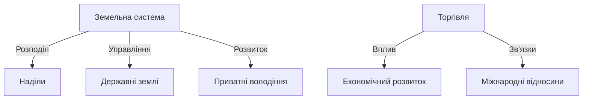

### Культурні досягнення:
1. Література:
   - Кодзікі (古事記): записи древніх справ
   - Ніхон Шьокі (日本書紀): хроніки Японії
   - Манйошю (万葉集): збірка поезії

2. Мистецтво:
   - Буддійська скульптура
   - Храмова архітектура
   - Світський живопис

3. Освіта:
   - Університет (Дайґакурьо)
   - Провінційні школи
   - Монастирські школи

[Попередні епохи зберігаються...]

## Хейан (794-1185)
**Ненґо:** "Енряку" (延暦, "Продовження календаря")
### Передумови оголошення епохи:
- Перенесення столиці до Хейан-кьо (сучасний Кіото)
- Прагнення імператора Камму обмежити вплив буддійських монастирів Нари
- Потреба в новому адміністративному центрі

### Імператори та їх особливості:
- **Камму** (781-806): засновник нової столиці
- **Саґа** (809-823): покровитель мистецтв
- **Сейва** (858-876): початок домінування Фудзівара
- **Ґо-Сандзьо** (1068-1073): спроба обмежити вплив Фудзівара
- Ґ**о-Шіракава** (1155-1158): розвиток інституту імператорів-ченців

### Видатні постаті:
  - *Фудзівара но Мітінага* — наймогутніший регент Хейанського періоду.
  - *Мурасакі Сікібу* — авторка роману *Ґендзі моногатарі*.

### Релігійний розвиток:
1. Нові буддійські школи:
   - Тендай (天台): заснована Сайтьо
   - Шінґон (真言): заснована Кукаєм
   - Дзьодо (浄土): вчення про Чисту Землю

2. Синкретизм:
   - Рьобу Шінто (両部神道): синтез буддизму та синтоїзму
   - Культ камі-буддів
   - Гірський аскетизм (Шюґендо)

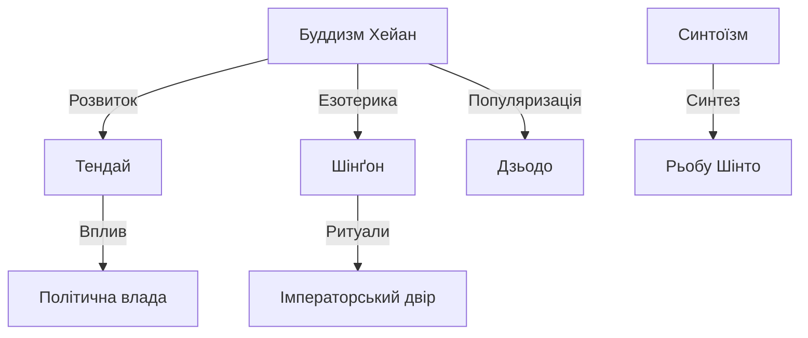

### Політична система:
1. Система регентства:
   - Сессьо (攝政): регент при неповнолітньому імператорі
   - Кампаку (関白): регент при дорослому імператорі
   - Інсей (院政): правління імператорів-ченців

2. Провінційне управління:
   - Занепад системи ріцурьо
   - Розвиток системи шьоен
   - Поява місцевих військових лідерів (буші)

### Становлення самурайського стану:
1. Військова служба:
   - Формування буші-дан (武士団)
   - Розвиток кінного бою
   - Кодекс честі

2. Клани:
   - Тайра: морські воїни
   - Мінамото: східні провінції
   - Фудзівара: придворна аристократія

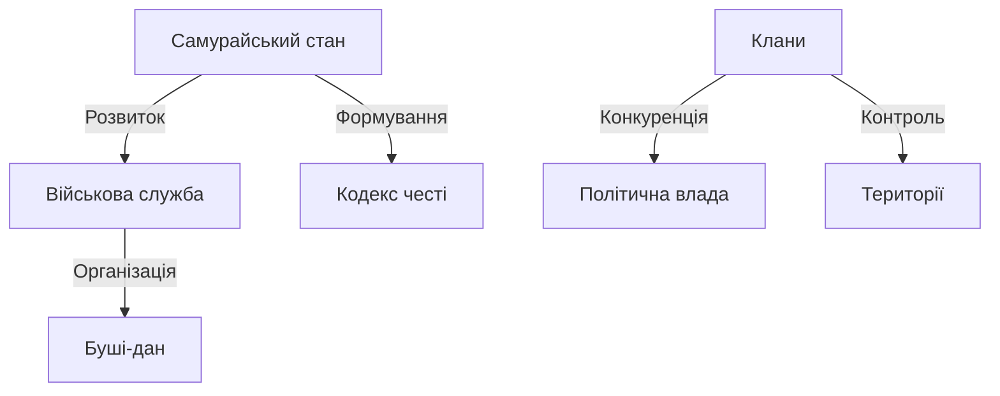

### Культурний розквіт:
1. Література:
   - Кокінвакашю (古今和歌集): імператорська антологія
   - Ґендзі Моноґатарі: роман Мурасакі Шікібу
   - Макура но Соші: есе Сей Шьонаґон

2. Мистецтво:
   - Ямато-е: японський живопис
   - Каліграфія кана
   - Придворна музика (ґаґаку)

3. Побут аристократії:
   - Моно но аваре (物の哀れ): естетичний ідеал
   - Складна система етикету
   - Сезонні фестивалі

### Естетичні ідеали Хейан
- Ідея *моно но аваре* (物の哀れ), тобто "сумне співчуття речам", стала основою придворної культури.
- Це відображено в романі *Ґендзі Моноґатарі* Мурасакі Шікібу, де емоції героїв тісно пов'язані з природою та минущістю життя.
- Придворна музика ґаґаку та каліграфія також відображали цю естетику.

## Камакура (1185-1333)
**Ненґо:** "Бундзі" (文治, "Цивільне правління")
### Передумови оголошення епохи:
- Перемога клану Мінамото у війні Ґемпей
- Встановлення першого сьоґунату
- Перенесення політичного центру до Камакури

### Сьоґуни та імператори:
1. Сьоґуни:
   - **Мінамото но Йорітомо** (1192-1199): перший сьоґун
   - **Мінамото но Йоріїе** (1202-1203)
   - **Ходзьо як сіккени** (執権, регенти сьоґунату)

1. Імператори:
   - **Ґо-Тоба** (1183-1198): спроба відновити імперську владу
   - **Дзюнтоку** (1210-1221): учасник смути Дзьокю
   - **Ґо-Саґа** (1242-1246): співпраця з сьоґунатом

### Видатні постаті:
  - *Мінамото но Йорітомо* — перший сегун Камакурського сегунату.
  - *Нітірен* — засновник буддійської школи Нітірен.

### Політична система:
1. Структура сьоґунату:
   - Мандокоро (政所): адміністративна палата
   - Монтюдзьо (問注所): судова палата
   - Самурай-докоро (侍所): військова палата

2. Система ґокенін (御家人):
   - Прямі васали сьоґуна
   - Територіальне управління
   - Військові обов'язки

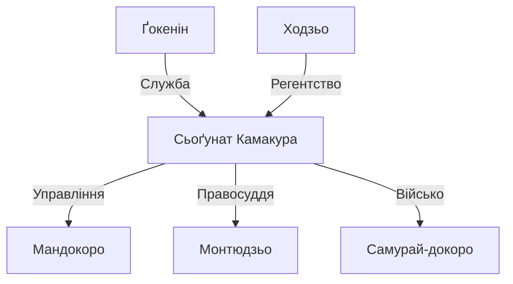

### Релігійний розвиток:
1. Нові буддійські школи:
   - Дзен-буддизм:
     * Ріндзай (臨済): засновник Ейсай
     * Сото (曹洞): засновник Доґен
   - Нітірен (日蓮): заснована Нітіреном
   - Дзьодо Шін (浄土真): заснована Шінраном

2. Взаємодія з самурайством:
   - Дзен як духовна практика воїнів
   - Вплив на естетику та мистецтво
   - Розвиток монастирської культури

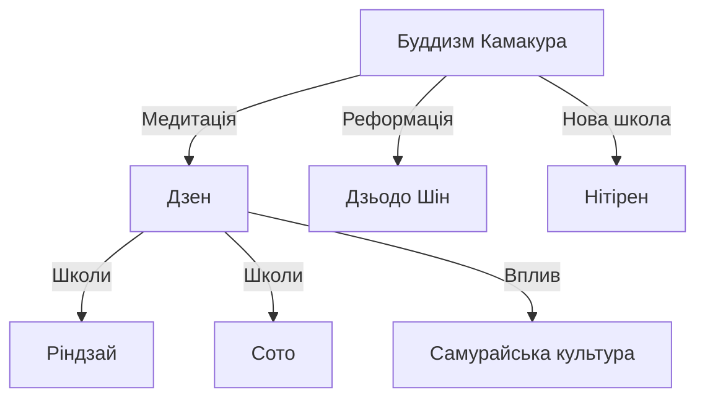

### Військова організація:
1. Бакуфу (幕府):
   - Централізоване військове управління
   - Система васальної залежності
   - Військові суди

2. Розвиток військового мистецтва:
   - Кінний бій
   - Фехтування (кендзюцу)
   - Стрільба з лука (кюдзюцу)

### Кодекс Бушідо
- *Бушідо* розвивався як моральна та етична основа для самураїв.
- Основними принципами були вірність господарю (ґірі), честь (меійо) і готовність до самопожертви.
- Практика сеппуку (ритуального самогубства) стала частиною цього кодексу, підкреслюючи важливість честі.

### Економічні зміни:
1. Земельні відносини:
   - Система дзіто (地頭)
   - Розвиток шьоен
   - Початок торгової економіки

2. Міжнародна торгівля:
   - Відносини з Китаєм династії Сун
   - Торгівля з Кореєю
   - Боротьба з монгольськими вторгненнями (1274, 1281)

### Культурні досягнення:
1. Література:
   - Військові епоси (ґункі моноґатарі)
   - Хейке Моноґатарі
   - Дзен-поезія

2. Мистецтво:
   - Скульптура будд і бодхісаттв
   - Портретний живопис
   - Архітектура дзен-монастирів

## Муроматі (1336-1573)
**Ненґо:** "Кенму" (建武, "Створення військової доблесті")
### Передумови оголошення епохи:
- Падіння сьоґунату Камакура
- Реставрація Кенму імператора Ґо-Дайґо
- Встановлення сьоґунату Ашікаґа

### Сьоґуни та імператори:
1. Сьоґуни Ашікаґа:
   - **Такаудзі** (1338-1358): засновник сьоґунату
   - **Йошімаса** (1449-1473): покровитель мистецтв
   - **Йошітеру** (1546-1565): спроба реформ

2. Імператорські лінії:
   - Північний двір (Кіото):
     * **Коґон** (1332-1333)
     * **Комьо** (1336-1348)
   - Південний двір (Йошіно):
     * **Ґо-Дайґо** (1318-1339)
     * **Ґо-Мураками** (1339-1368)

### Видатні постаті:
  - *Ашікаґа Такаудзі* — засновник сегунату.
  - *Іккю Содзюн* — видатний дзен-буддійський монах.

### Політична система:
1. Структура влади:
   - Сьоґунат у Кіото
   - Система шюґо-даймьо
   - Канрей (管領): головні радники

2. Територіальне управління:
   - Провінційні військові губернатори
   - Автономні міста (ракутю-ракуґай)
   - Сільські самоврядні общини (со)

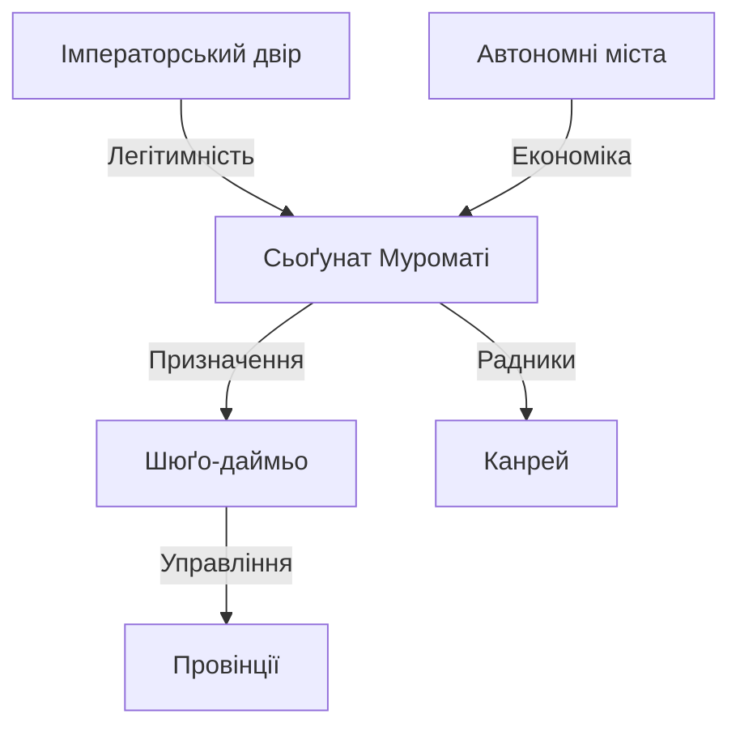

### Економічний розвиток:
1. Торгівля:
   - Система за (座): торгові гільдії
   - Морська торгівля з Китаєм і Кореєю
   - Поява професійних купців

2. Сільське господарство:
   - Поліпшення іригації
   - Нові сорти рису
   - Розвиток місцевих ринків

### Релігійні трансформації:
1. Дзен-буддизм:
   - Вплив на культуру та мистецтво
   - Система П'яти гір (ґозан)
   - Розвиток храмової архітектури

2. Інші релігійні течії:
   - Ікко-ікки: повстання послідовників Дзьодо Шін
   - Нітірен: зростання впливу в містах
   - Синкретичні культи

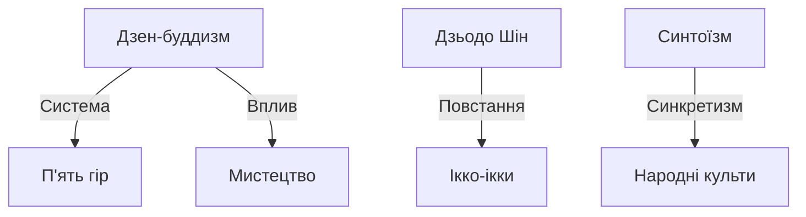

### Культурні досягнення:
1. Мистецтво:
   - Сад каменів (карешансуй)
   - Живопис тушшю (суйбокуґа)
   - Чайна церемонія (тя-но-ю)

2. Архітектура:
   - Золотий павільйон (Кінкаку-дзі)
   - Срібний павільйон (Ґінкаку-дзі)
   - Дзен-храми

3. Література:
   - Поезія рейнґа
   - Театр но
   - Драми кьоґен

### Період Сенґоку (1467-1573):
1. Причини роздробленості:
   - Війна Онін (1467-1477)
   - Ослаблення сьоґунату
   - Зростання влади даймьо

2. Військові лідери:
   - **Ода Нобунаґа**: початок об'єднання
   - **Такеда Шінґен**: контроль центральної Японії
   - **Уесуґі Кенші**н: володар півночі

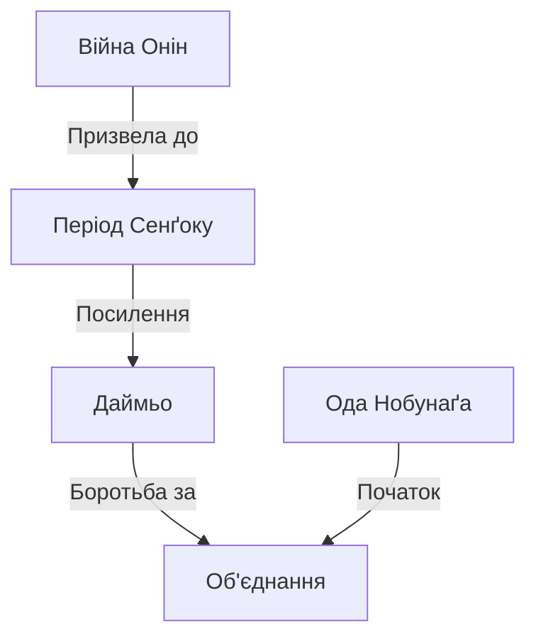

## Адзуті-Момояма (1573-1603)
**Ненґо:** "Теншьо" (天正, "Небесна справедливість")
### **Передумови оголошення епохи**

- Завершення періоду Сенґоку і початок централізації влади Одою Нобунаґою.
- Падіння сьоґунату Муроматі та ослаблення впливу старих самурайських кланів.
- Формування єдиної держави під проводом Тойотомі Хідейоші.

### **Сьогуни та видатні постаті**

- **Ода Нобунаґа** (1534-1582): почав об'єднання Японії, реформатор.
- **Тойотомі Хідейоші** (1537-1598): завершив об'єднання, ініціював вторгнення в Корею.
- **Ієясу Токуґава** (1543-1616): засновник династії Токуґава, що встановила стабільність в епоху Едо.
### Політична трансформація:
1. Централізація влади:
   - Ліквідація автономії даймьо
   - Створення єдиної системи управління
   - Уніфікація законодавства

2. Реформи Оди Нобунаґи:
   - Скасування внутрішніх митниць
   - Стандартизація мір та ваг
   - Заборона піратства
   - Боротьба з буддійськими монастирями

3. Політика Тойотомі Хідейоші:
   - Заборона носіння зброї селянами (катанаґарі)
   - Перепис населення та земель
   - Заборона зміни соціального стану
   - Корейські кампанії (1592-1598)

### Релігійні конфлікти:
1. Протистояння з буддійськими сектами:
   - Знищення монастиря Енряку-дзі (1571)
   - Придушення Ікко-ікки
   - Обмеження впливу буддійського духовенства

2. Християнство:
   - Місіонерська діяльність єзуїтів
   - Навернення даймьо південних провінцій
   - Початок переслідувань християн

### Економічні перетворення:
1. Земельна реформа:
   - Система кокудака
   - Розмежування земель
   - Видача офіційних документів на володіння

2. Розвиток торгівлі:
   - Формування торгових міст
   - Поява перших мануфактур
   - Початок міжнародної торгівлі

### Культурний розвиток:
1. Архітектура:
   - Будівництво кам'яних замків
   - Нові фортифікаційні технології
   - Розвиток садово-паркового мистецтва

2. Мистецтво:
   - Школа Кано
   - Чайна церемонія
   - Театр но та кьоген

## Едо (1603-1868)
**Ненґо:** "Кейтьо" (慶長, "Благословенне правління")
### **Передумови оголошення епохи**

- Перемога Токуґави Ієясу у битві при Секіґахара (1600).
- Встановлення системи бакухан з централізованим контролем сьоґунату.
- Затвердження спадкової системи управління, що забезпечило стабільність.

### **Сьогуни та видатні постаті**

- **Токуґава Ієясу** (1603-1605): перший сьоґун епохи Едо.
- **Токуґава Йошімуне** (1716-1745): реформатор фінансової системи.
- **Сакамото Рьома** (1836-1867): реформатор і політик, що сприяв Реставрації Мейдзі.
### Політична система:
1. Структура сьоґунату:
   - Родзю (老中): вища рада
   - Вакадошійорі (若年寄): молодша рада
   - Омецуке (大目付): інспектори

2. Система бакухан:
   - Прямі володіння сьоґунату (тенрьо)
   - Землі даймьо (хан)
   - Контроль через санкін котай

3. Соціальна ієрархія:
   - Самураї (ші)
   - Селяни (но)
   - Ремісники (ко)
   - Торговці (шьо)

### Зовнішня політика:
1. Сакоку (закрита країна):
   - Заборона християнства
   - Обмеження зовнішньої торгівлі
   - Дозволені контакти через Наґасакі

2. Міжнародні відносини:
   - Торгівля з Китаєм
   - Обмежені контакти з Голландією
   - Відносини з Кореєю через Цушіму

### Економічний розвиток:
1. Сільське господарство:
   - Нові методи іригації
   - Впровадження добрив
   - Подвійні врожаї

2. Торгівля та фінанси:
   - Розвиток рисового ринку
   - Поява оптової торгівлі
   - Створення фінансових домів

3. Урбанізація:
   - Зростання Едо
   - Розвиток призамкових міст
   - Формування торгових центрів

### Культурне життя:
1. Література:
   - Проза укійо-дзоші
   - Поезія хайку
   - Розвиток драматургії

2. Театральне мистецтво:
   - Кабукі
   - Бунраку
   - Продовження традицій но

3. Образотворче мистецтво:
   - Укійо-е
   - Школа Кано
   - Школа Рін

## Мейдзі (1868-1912)
**Ненґо:** "Мейдзі" (明治, "Просвітлене правління")
### **Передумови оголошення епохи**

- Реставрація імператорської влади після падіння сьоґунату Токуґава.
- Початок модернізації Японії за західними зразками.
- Відкриття країни після періоду ізоляції (сакоку).
### **Імператори та видатні постаті**

- **Імператор Мейдзі** (1868-1912): реформатор, символ модернізації Японії.
- **Окубо Тошіміті** (1830-1878): один із трьох великих реформаторів епохи Мейдзі.
- **Фукузава Юкіті** (1835-1901): філософ і освітній реформатор.

### Політичні реформи:
1. Державний устрій:
   - Конституція 1889 року
   - Створення парламенту
   - Формування кабінету міністрів

2. Адміністративна реформа:
   - Скасування ханів
   - Створення префектур
   - Уніфікація управління

### Модернізація:
1. Військова реформа:
   - Створення регулярної армії
   - Загальна військова повинність
   - Розвиток флоту

2. Освітня реформа:
   - Загальна початкова освіта
   - Створення університетів
   - Відправка студентів за кордон

3. Економічні перетворення:
   - Індустріалізація
   - Розвиток залізниць
   - Створення дзайбацу

### Зовнішня політика:
1. Дипломатія:
   - Перегляд нерівноправних договорів
   - Війна з Китаєм (1894-1895)
   - Російсько-японська війна (1904-1905)

2. Територіальна експансія:
   - Приєднання Рюкю
   - Колонізація Хоккайдо
   - Анексія Кореї

## Тайшьо (1912-1926)
**Ненґо:** "Тайшьо" (大正, "Велика справедливість")
### **Передумови оголошення епохи**

- Посилення демократичних рухів та створення конституційного уряду.
- Зростання впливу політичних партій та ролі парламенту.
- Смерть імператора Мейдзі і початок нової епохи.

### **Імператори та видатні постаті**

- **Імператор Тайшьо** (1912-1926): період демократичних реформ.
- **Йошіно Саґаро** (1878-1933): лідер руху за демократизацію Японії.
### Політичний розвиток:
1. Демократія Тайшьо:
   - Посилення ролі парламенту
   - Поява партійних кабінетів
   - Розширення виборчого права

2. Бюрократична система:
   - Зростання впливу цивільної бюрократії
   - Послаблення влади ґенро (元老, старійшин)
   - Розвиток місцевого самоврядування

### Економічні трансформації:
1. Промисловість:
   - Розвиток важкої промисловості
   - Зміцнення дзайбацу (財閥, фінансово-промислові конгломерати)
   - Економічний бум періоду Першої світової війни

2. Соціальні зміни:
   - Урбанізація
   - Формування робітничого класу
   - Початок профспілкового руху

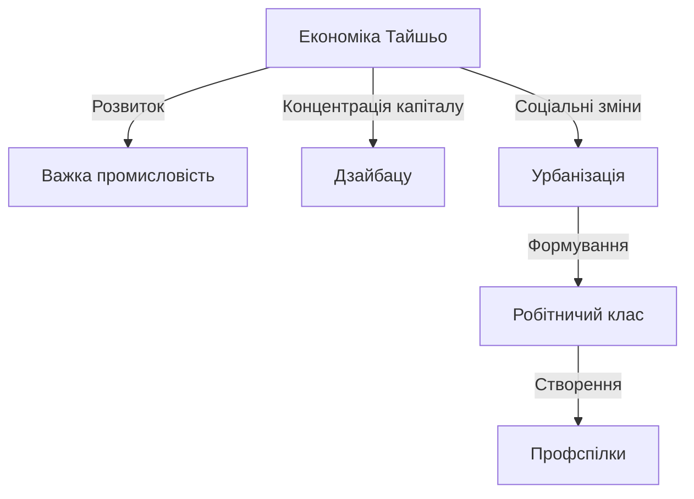

### Релігійне життя:
1. Державний синтоїзм:
   - Посилення ролі як державної ідеології
   - Розвиток храмової системи
   - Інтеграція з освітою

2. Нові релігійні рухи:
   - Омото-кьо (大本教): синкретичний рух
   - Реформістський буддизм
   - Християнські громади

## Шьова (1926-1989)
**Ненґо:** "Шьова" (昭和, "Просвітлений мир")
### **Передумови оголошення епохи**

- Індустріалізація та модернізація, початок економічного зростання.
- Зміцнення ролі військових у політиці.
- Смерть імператора Тайшьо і сходження на трон імператора Хірохіто.

### **Імператори та видатні постаті**

- **Імператор Шьова (Хірохіто)** (1926-1989): правив у періоди до і після Другої світової війни.
- **Мацусіта Коносуке** (1894-1989): засновник корпорації Panasonic.
- **Акіхіто** (1989-2019): імператор, який символізував післявоєнний прогрес.
### Довоєнний період (1926-1945):
1. Політична система:
   - Мілітаризація влади
   - Скасування партійних кабінетів
   - Встановлення військової диктатури

2. Економічна політика:
   - Військова економіка
   - Розширення дзайбацу
   - Колоніальна експлуатація

### Післявоєнний період (1945-1989):
1. Політичні реформи:
   - Нова конституція 1947 року
   - Демілітаризація
   - Система ЛДП (自民党, Ліберально-демократична партія)

2. Економічне диво:
   - Кейрецу (系列, нові бізнес-групи замість дзайбацу)
   - Експортно-орієнтована економіка
   - Розвиток високих технологій

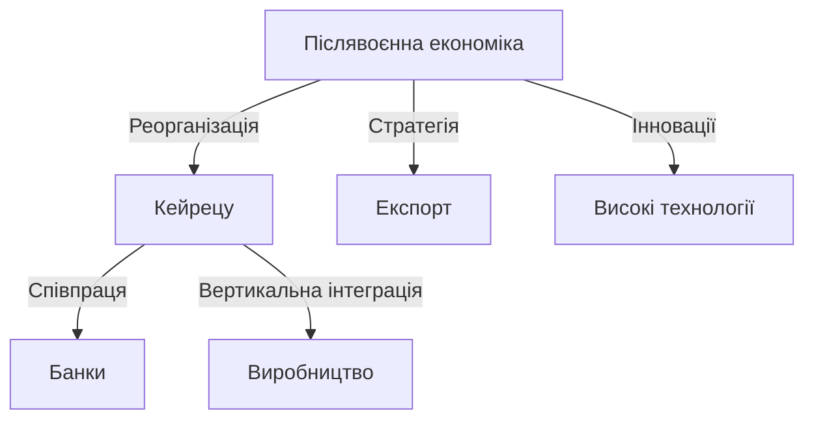

### Релігійні трансформації:
1. Деідеологізація синто:
   - Відділення від держави
   - Трансформація в народну релігію
   - Збереження ритуальних практик

2. Нові релігійні рухи:
   - Сока Ґаккай (創価学会)
   - Ріссьо Косей-кай (立正佼成会)
   - Тенрікьо (天理教)

## Хейсей (1989-2019)
**Ненґо:** "Хейсей" (平成, "Досягнення миру")
### **Передумови оголошення епохи**

- Завершення періоду післявоєнної стабілізації.
- Економічна стагнація через "лопання фінансової бульбашки".
- Смерть імператора Хірохіто і сходження на трон імператора Акіхіто.

### **Імператори та видатні постаті**

- **Імператор Акіхіто** (1989-2019): правив під час економічної стагнації.
- **Шіндзо Абе** (1954-2022): прем'єр-міністр, ініціатор політики "абеноміка".
### Економічні виклики:
1. Економічна стагнація:
   - Лопання фінансової бульбашки
   - Дефляція
   - Проблема державного боргу

2. Структурні реформи:
   - Лібералізація фінансового сектору
   - Реформа корпоративного управління
   - Політика "абеноміки"

### Соціальні зміни:
1. Демографічні проблеми:
   - Старіння населення
   - Низька народжуваність
   - Скорочення робочої сили

2. Технологічний розвиток:
   - Роботизація
   - Цифровізація
   - Розвиток індустрії розваг

## Рейва (2019-теперішній час)
**Ненґо:** "Рейва" (令和, "Прекрасна гармонія")

### **Передумови оголошення епохи**

- Відставка імператора Акіхіто і передача трону імператору Нарухіто.
- Сучасні виклики: демографічна криза, цифровізація та екологічні проблеми.
- Початок політичних і економічних реформ для адаптації до глобалізованого світу.

### **Імператори та видатні постаті**

- **Імператор Нарухіто** (2019 - теперішній час): фокусується на екології та міжнародних відносинах.
- **Фуміо Кішіда** (1957 - теперішній час): прем'єр-міністр, що сприяє стабілізації Японії у сучасних викликах.
### Сучасні виклики:
1. Економічна політика:
   - Подолання наслідків пандемії
   - Цифрова трансформація
   - Зелена енергетика

2. Міжнародні відносини:
   - Стратегічне партнерство зі США
   - Територіальні суперечки
   - Регіональна безпека

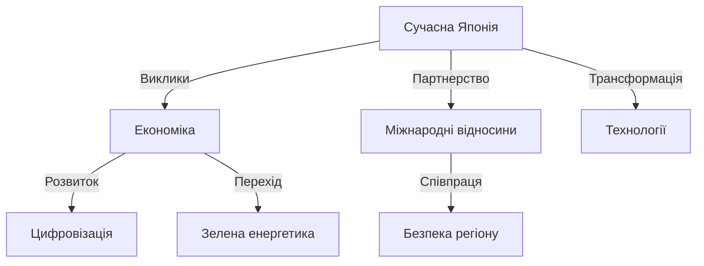

### Релігійне життя:
1. Традиційні релігії:
   - Секуляризація суспільства
   - Збереження ритуальних практик
   - Туристифікація храмів

2. Сучасні тенденції:
   - Індивідуалізація релігійності
   - Екологічні рухи
   - Міжрелігійний діалог

#Факти #Історія

[[Японська міфологія - Синтоїзм, ками, легенди про імператорську родину]]