# Історія французьких династій: від Меровінгів до Бонапартів

```table-of-contents
title: ## Зміст
minLevel: 2
maxLevel: 3
```

## **1. Меровінги (481–751): витоки французької монархії**

### **1.1 Хлодвіг I (466–511): засновник Франкського королівства**
- **Хрещення Хлодвіга (496)**:
  - Важливий акт союзу з католицькою церквою.
  - **Наслідки**: Франція стала центром християнської Європи.
- **Політичні реформи**:
  - Консолідація франків; створення адміністративної системи.
- **Культурний вплив**:
  - Виникнення легенд про Меровінгів, де їх зображали як обраних Божих правителів.

### **1.2 "Ледачі королі" і роль майордомів**
- Втрата Меровінгами реальної влади.
- **Карл Мартелл**: Зупинив мусульманське вторгнення у битві при Пуатьє (732), заклав основу для Каролінгів.

#### Династія Меровінгів

| **Ім'я короля** | **Роки правління** | **Основні досягнення**       |
| --------------- | ------------------ | ---------------------------- |
| **Хлодвіг I**   | 481–511            | Об’єднання франків, хрещення |
| **Хлотар I**    | 558–561            | Розширення королівства       |
| **Теодоріх IV** | 721–737            | Передача влади майордомам    |

---

## **2. Каролінги (751–987): імператорська доба**

### **2.1 Карл Великий (742–814): архітектор імперії**
- **Імператорська коронація (800)**:
  - Відновлення ідеї Римської імперії в Європі.
- **Реформи**:
  - Освіта: створення шкіл при монастирях.
  - Мистецтво: каролінзьке відродження.
- **Культурний вплив**:
  - "Пісня про Роланда" — літературний символ християнської доблесті.

### **2.2 Людовик Благочестивий (778–840): початок занепаду**
- Поділ імперії між синами за Верденською угодою (843), що призвело до створення Франції.

---

## **3. Капетинги (987–1328): від феодалізму до національної монархії**

### **3.1 Гуго Капет (941–996): зміцнення трону**
- **Реформа престолонаслідування**:
  - Встановив систему передачі трону в межах однієї родини.
- **Культурна спадщина**:
  - Зміцнення відносин між церквою і монархією.

### **3.2 Людовик IX (Святий) (1214–1270): ідеал християнського монарха**
- **Хрестові походи**:
  - Лідер двох походів, незважаючи на їхній провал.
- **Будівництво Сент-Шапель**:
  - Готична перлина Парижа, що символізує духовний підйом епохи.

#### Ключові досягнення Капетингів

| **Король**     | **Досягнення**                              |
| -------------- | ------------------------------------------- |
| **Гуго Капет** | Заснування династії                         |
| **Людовик VI** | Зміцнення королівської влади над васалами   |
| **Людовик IX** | Канонізація, дипломатія, підтримка культури |

---

## **4. Валуа (1328–1589): війни та мистецьке відродження**

### **4.1 Столітня війна (1337–1453)**
- **Жанна д'Арк**:
  - Підняла мораль французів під час облоги Орлеана (1429).
  - Канонізація (1920) закріпила її образ у національній свідомості.
- **Кінець війни**:
  - Англійців вигнали з Франції; почалося об'єднання королівства.

### **4.2 Франциск I (1494–1547): патрон Ренесансу**
- **Запрошення Леонардо да Вінчі**:
  - Франциск придбав "Джоконду", що стала національною скарбницею.
- **Розвиток архітектури**:
  - Замок Шамбор як вершина ренесансної естетики.

---

## **5. Бурбони (1589–1792, 1814–1830): апогей абсолютної монархії**

### **5.1 Людовик XIV (1638–1715): Король-Сонце**
- **Абсолютизм**:
  - "Держава — це я": централізація влади.
- **Культура**:
  - Версаль став символом епохи, а театр процвітав завдяки Мольєру.

### **5.2 Французька революція (1789–1799)**
- **Людовик XVI**:
  - Страта короля у 1793 році стала символом кінця монархії.
- **Культурні наслідки**:
  - Експресивні картини Жака-Луї Давида, зокрема "Смерть Марата".

---

## **6. Наполеонівські імперії (1804–1815, 1852–1870)**

### **6.1 Наполеон I (1769–1821): символ величі**
- **Кодекс Наполеона**:
  - Став основою юридичних систем багатьох країн.
- **Культурна спадщина**:
  - Художні шедеври Давида ("Наполеон переходить через Альпи").

### **6.2 Наполеон III (1808–1873): модернізація Франції**
- **Перебудова Парижа**:
  - Барон Осман створив сучасну архітектуру міста.

***
## Хронологія французьких королівських династій

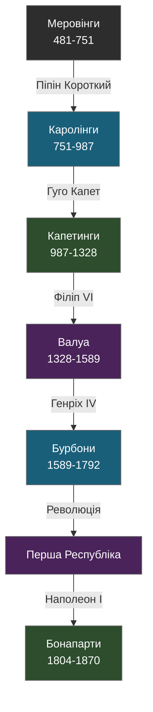
---

## Салічне право та його вплив на французьку монархію

### Основні принципи

- **Походження**: Кодифіковано за Хлодвіга I (бл. 500 р.)
- **Ключове положення**: Заборона успадкування престолу по жіночій лінії
- **Цитата з оригінального тексту**:

> "*De terra vero Salica nulla portio hereditatis mulieri veniat*"
> (*Щодо салічної землі, жодна частка спадщини не може перейти до жінки*)

### Наслідки для престолонаслідування

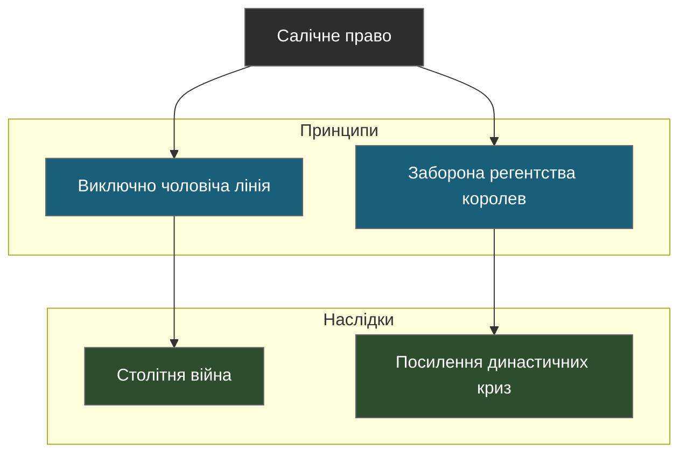

### Важливі прецеденти застосування салічного права

#### Криза 1316-1328 років

- **Причини**:
  - Смерть Людовика X (1316)
  - Питання про права його дочки Жанни та посмертно народженого сина Жана I
- **Наслідки**:
  - Встановлення прецеденту виключення жінок від престолонаслідування
  - Прихід до влади Філіпа V, а потім Карла IV

#### Династична криза 1328 року

- **Претенденти на престол**:
  - Едуард III Англійський (онук Філіпа IV по матері)
  - Філіп VI Валуа (племінник Філіпа IV по чоловічій лінії)
- **Результат**:
  - Початок династії Валуа
  - Зародження конфлікту, що призвів до Столітньої війни

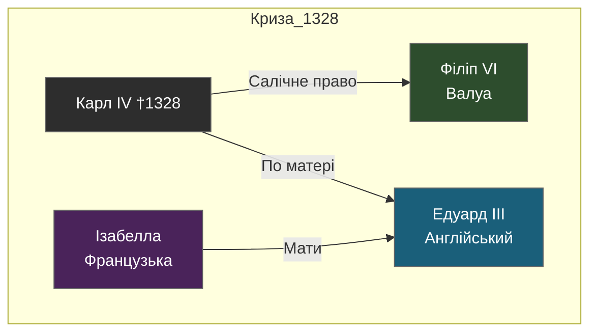

## Династичні конфлікти та престолонаслідування

### Столітня війна (1337-1453)

- **Причини конфлікту**:
  - Претензії англійської корони на французький престол
  - Територіальні суперечки щодо континентальних володінь Англії
- **Ключові моменти**:
  - Битва при Кресі (1346)
  - Договір в Бретіньї (1360)
  - Відновлення війни за Карла V
  - Битва при Азенкурі (1415)
  - Місія Жанни д'Арк (1429-1431)

#### Порівняльна таблиця претензій на престол

| Аспект | Династія Валуа | Династія Плантагенетів |
|--------|----------------|------------------------|
| **Основа претензій** | Пряма чоловіча лінія | Спадкування через жіночу лінію |
| **Правова база** | Салічне право | Звичаєве право Англії |
| **Підтримка знаті** | Більшість французької знаті | Гасконь, Фландрія |
| **Легітимність** | Визнання Генеральних штатів | Претензії через Ізабеллу Французьку |

### Механізми престолонаслідування

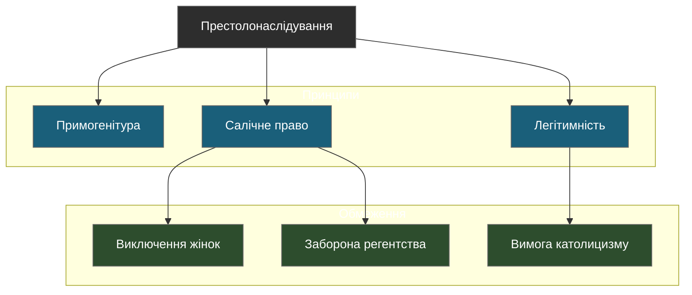

### Інструменти легітимації влади

#### Церемоніальні аспекти

- **Коронація в Реймсі**
  - Священне миропомазання
  - Використання регалій Карла Великого
- **Королівські чудеса**
  - Зцілення золотух
  - Цитата з хроніки Віллардуена:

> "*І коли король торкнувся хворих, вони зцілилися, як це було завжди з милості Божої та привілею королів Франції*"

#### Правові механізми

- **Генеральні штати**
  - Формальне визнання нового монарха
  - Затвердження важливих державних рішень
- **Парламент Парижа**
  - Реєстрація королівських указів
  - Юридичне обґрунтування престолонаслідування

## Символічні аспекти королівської влади

### Королівські регалії

#### Матеріальні символи влади

- **Корона Карла Великого**
  - Використовувалась при коронації до 1793 року
  - Знищена під час Французької революції
- **Скіпетр правосуддя**
  - Символізував судову владу монарха
  - Прикрашений рукою правосуддя
- **Меч Карла Великого (Жуайоз)**
  - Символ військової влади
  - Використовувався при церемонії посвячення в лицарі

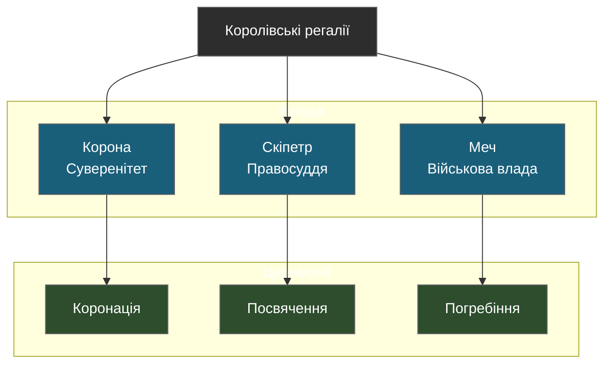

### Королівська геральдика

#### Еволюція королівського герба

- **Початковий період**
  - Золоті лілії на синьому полі (з часів Людовика VII)
  - Цитата з хроніки Гійома де Нанжі:

> "*Король обрав лілії як символ Святої Трійці та Діви Марії*"

- **Пізній період**
  - Три лілії (з часів Карла V)
  - Бурбонський варіант з ланцюгом ордена Святого Духа

### Порівняльний аналіз династичних традицій

#### Таблиця династичних особливостей

| Династія | Основа легітимності | Символи влади | Резиденції | Особливості правління |
|----------|---------------------|---------------|-------------|---------------------|
| Меровінги | Військова харизма | Довге волосся | Пересувний двір | Децентралізоване |
| Каролінги | Папське помазання | Імператорська корона | Аахен | Імперське |
| Капетинги | Спадкове право | Лілії | Париж, Сен-Дені | Феодальне |
| Валуа | Салічне право | Флер-де-ліс | Лувр | Централізоване |
| Бурбони | Божественне право | Сонце | Версаль | Абсолютистське |

### Трансформація концепції королівської влади

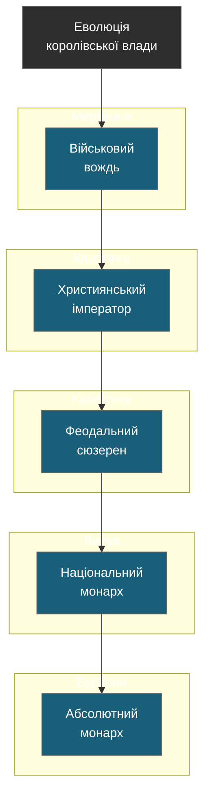

### Церемоніальні традиції

#### Коронаційний ритуал

- **Складові церемонії**:
  1. Присяга короля
  2. Помазання святим єлеєм
  3. Вручення регалій
  4. Коронація
  5. Інтронізація
- **Сакральні елементи**:
  - Свята ампула з Реймса
  - Орифламма (королівський штандарт)

#### Цитата з коронаційної присяги:

> "*Обіцяю перед Богом та цими святими Євангеліями підтримувати та захищати католицьку віру, здійснювати правосуддя для всіх моїх підданих...*"

### Інституційні інновації різних династій

#### Порівняльна таблиця адміністративних реформ

| **Династія** | **Адміністративні новації** | **Судові реформи**  | **Фінансові інститути**       |
| ------------ | --------------------------- | ------------------- | ----------------------------- |
| Меровінги    | Графства                    | Королівський суд    | Королівська скарбниця         |
| Каролінги    | Марки, місі домініці        | Палатинський суд    | Монетна реформа               |
| Капетинги    | Бальяжі, превотства         | Паризький парламент | Палата рахунків               |
| Валуа        | Генеральні штати            | Великий совет       | Податкові округи              |
| Бурбони      | Інтенданти                  | Державна рада       | Генеральний контроль фінансів |

## Розвиток державних інституцій

### Еволюція королівської адміністрації

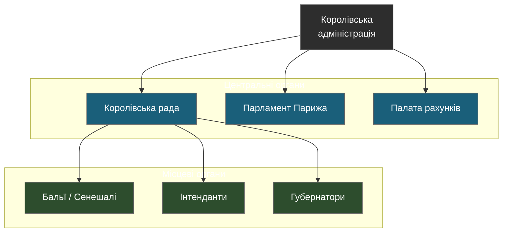

#### Еволюція центральних органів влади

| **Період** | **Орган влади**     | **Функції**                  | **Значення**                 |
| ---------- | ------------------- | ---------------------------- | ---------------------------- |
| XII ст.    | Королівська курія   | Дорадчий орган, суд          | Основа державного управління |
| XIII ст.   | Паризький парламент | Вищий суд, реєстрація указів | Розвиток правової системи    |
| XIV ст.    | Палата рахунків     | Фінансовий контроль          | Централізація фінансів       |
| XV ст.     | Великий совет       | Політичні рішення            | Посилення королівської влади |
| XVI ст.    | Державна рада       | Виконавча влада              | Професіоналізація управління |

### Відносини корони і церкви

#### Галліканська церква
- **Основні принципи**:
  1. Незалежність короля від папської влади
  2. Верховенство соборів над папою
  3. Дотримання "давніх звичаїв" французької церкви

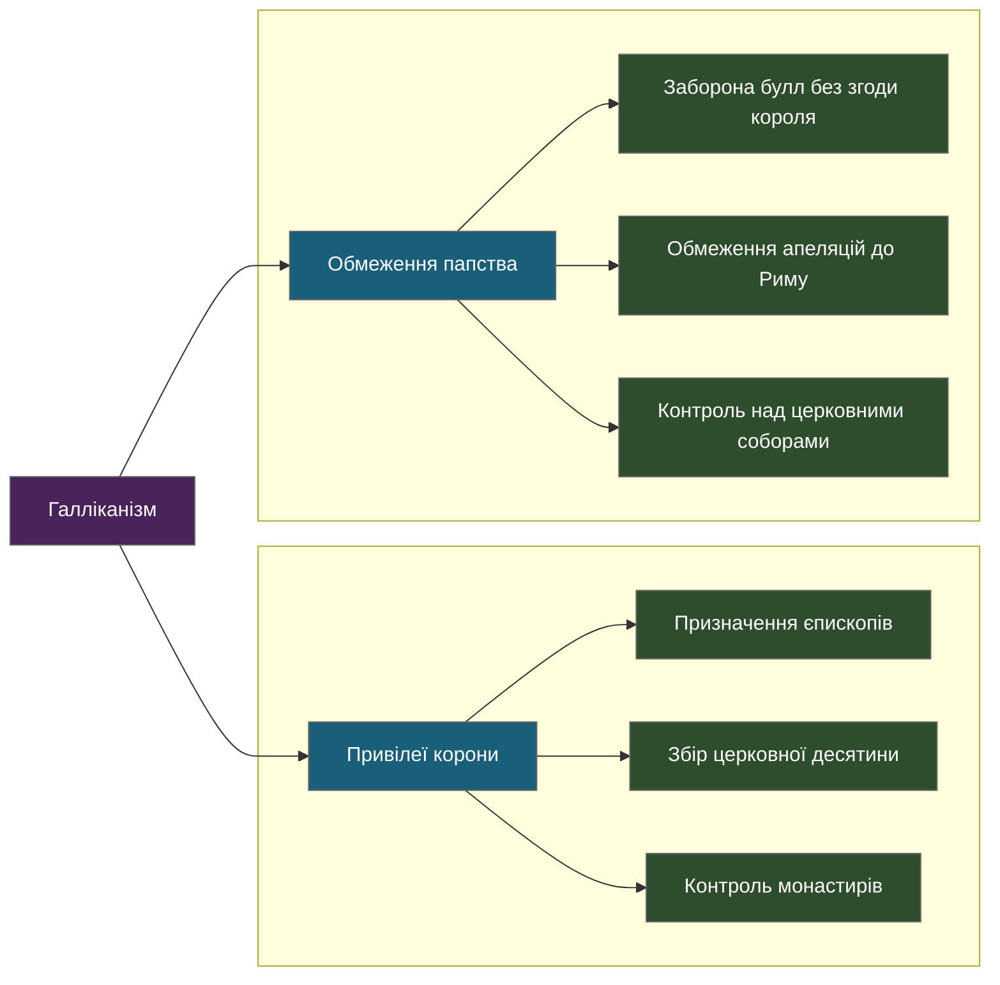

#### Прагматична санкція в Бурже (1438)
- **Ключові положення**:
  - Виборність церковних посад
  - Обмеження папських податків
  - Заборона апеляцій до Риму

> "Церква Франції користується своїми давніми свободами і привілеями..."
> — З тексту Прагматичної санкції

### Економічні аспекти монархічного правління

#### Фінансова система

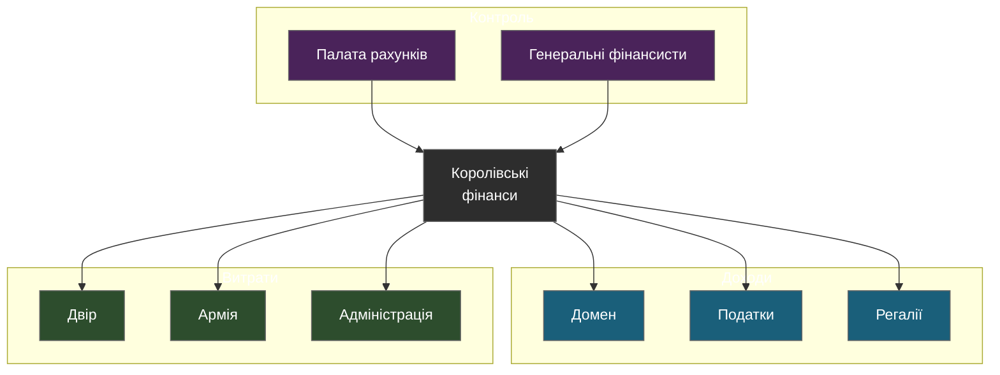

#### Порівняльна таблиця фінансових реформ

| Династія | Основні реформи | Нові податки | Фінансові інновації |
|----------|----------------|--------------|---------------------|
| Капетинги | Створення домену | Талья | Монетна стабільність |
| Валуа | Надзвичайні податки | Габель | Державні позики |
| Бурбони | Система відкупів | Капітація | Паперові гроші |

### Військова організація

#### Еволюція королівської армії

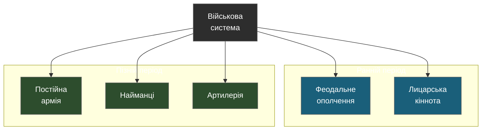

## Культурні аспекти монархії

### Королівський патронаж мистецтв

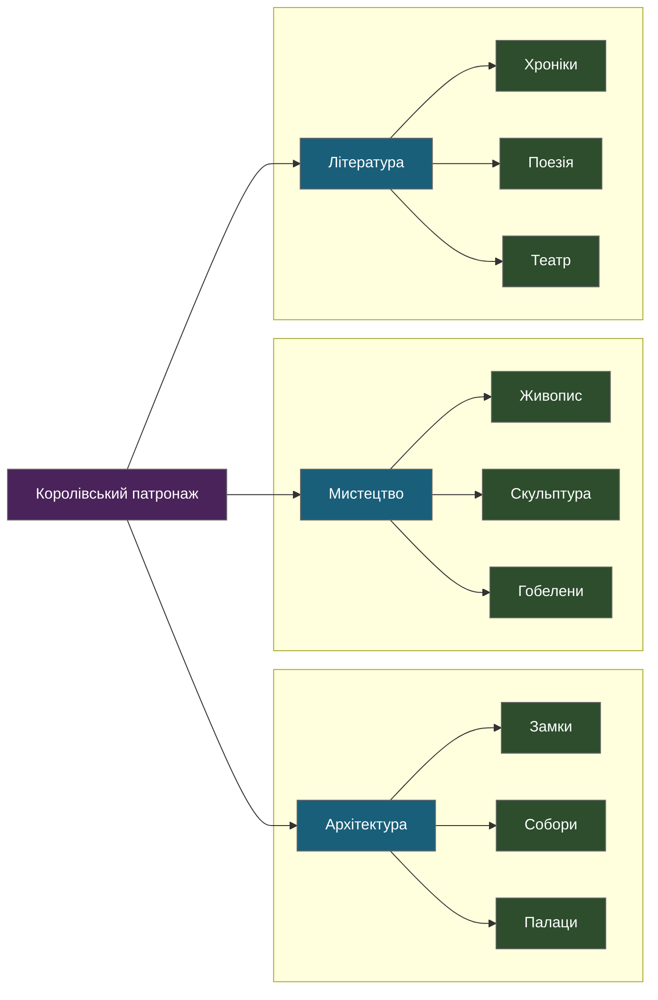

#### Архітектурні проекти династій

| **Династія** | **Основні будівлі** | **Стиль** | **Призначення** |
| ------------ | ------------------- | --------- | --------------- |
| Капетинги    | Сент-Шапель         | Готика    | Реліквіарій     |
| Валуа        | Лувр                | Ренесанс  | Резиденція      |
| Бурбони      | Версаль             | Бароко    | Репрезентація   |

### Придворне життя та етикет

#### Еволюція придворного церемоніалу

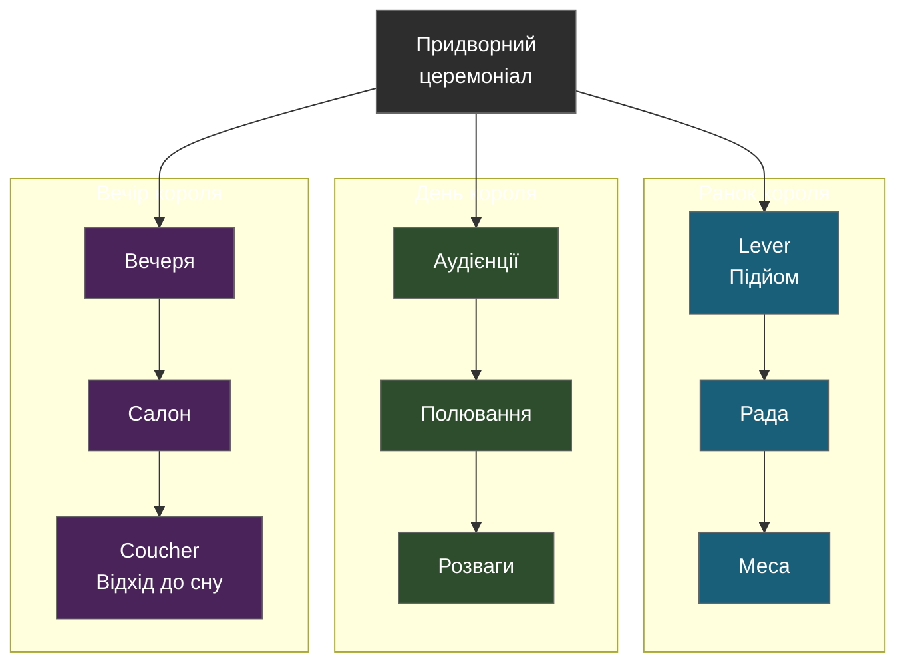

#### Цитата з "Мемуарів" Сен-Сімона про етикет Версаля:

> "Кожен жест, кожен крок короля був виміряний, розрахований, перетворений на символ величі держави"

### Придворні посади та ієрархія

#### Великі офіцери корони

| **Посада**       | **Функції**            | **Привілеї**     | **Династичний період** |
| ---------------- | ---------------------- | ---------------- | ---------------------- |
| Конетабль        | Військове командування | Право меча       | До 1627                |
| Канцлер          | Правосуддя             | Державна печатка | Всі періоди            |
| Великий камергер | Особисті покої короля  | Доступ до короля | Всі періоди            |
| Великий майстер  | Королівський дім       | Керування двором | Всі періоди            |

### Королівські резиденції та їх функції

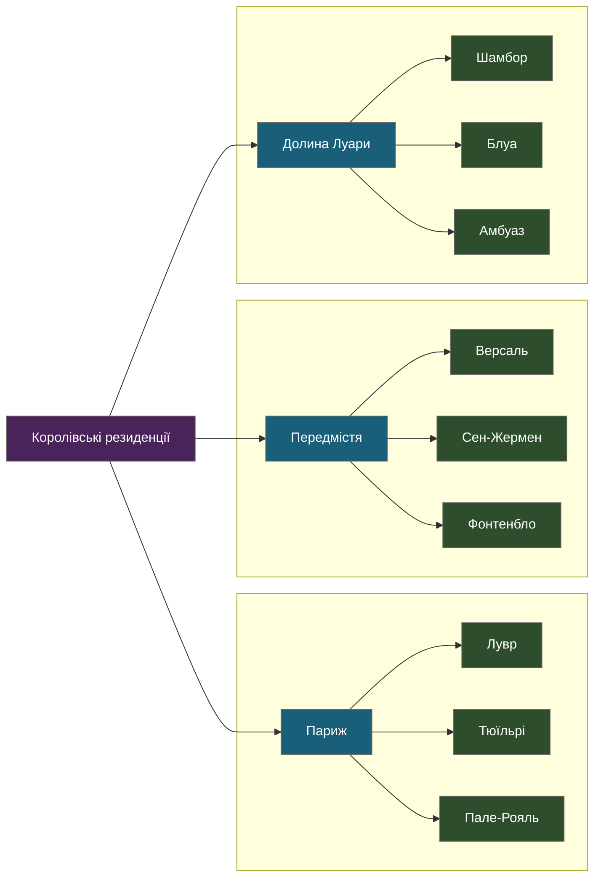

#### Версальська система

- **Архітектурна символіка**:
  - Схід сонця (Le Lever du Roi)
  - Дзеркальна галерея як символ прозорості влади
  - Сади як втілення упорядкованої природи

- **Соціальний контроль**:
  - Система апартаментів
  - Етикет як інструмент влади
  - Ієрархія доступу до короля

> "*Версаль - це машина, що перетворює дворянина на придворного*"
> — Людовик XIV

## Дипломатичні відносини монархії

### Еволюція французької дипломатії

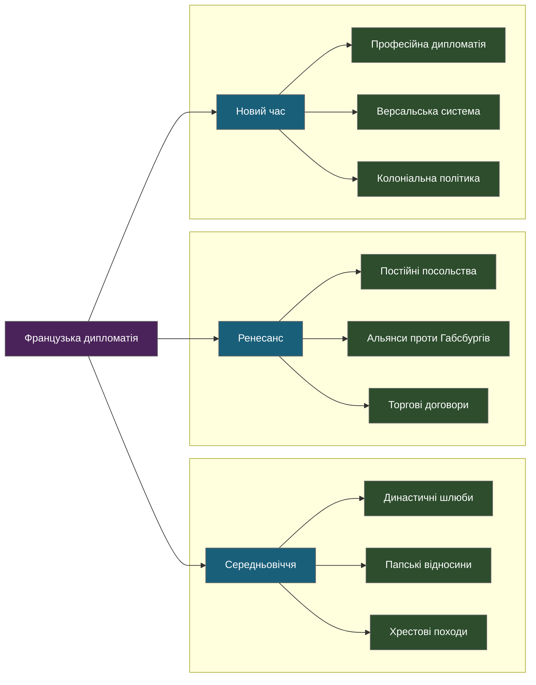

#### Династичні шлюби та їх наслідки

| **Період** | **Шлюб**                        | **Політичні наслідки**    | **Територіальні зміни**            |
| ---------- | ------------------------------- | ------------------------- | ---------------------------------- |
| 1284       | Філіп IV + Жанна Наваррська     | Приєднання Наварри        | Розширення на південь              |
| 1385       | Карл VI + Ізабелла Баварська    | Союз з німецькими князями | Вплив у Священній Римській імперії |
| 1491       | Карл VIII + Анна Бретонська     | Приєднання Бретані        | Завершення об'єднання Франції      |
| 1615       | Людовик XIII + Анна Австрійська | Зв'язки з Габсбургами     | Іспанська спадщина                 |

### Відносини з містами та буржуазією

#### Еволюція міської політики

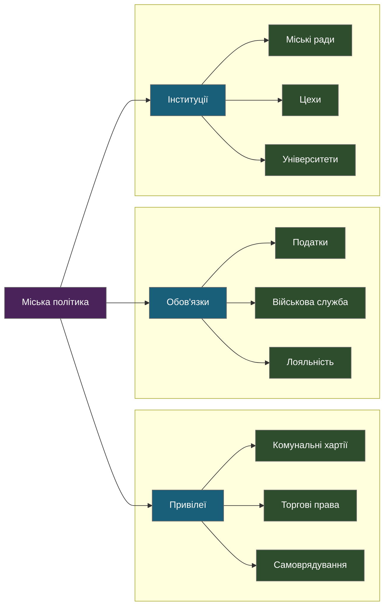

### Релігійна політика

#### Відносини з різними конфесіями

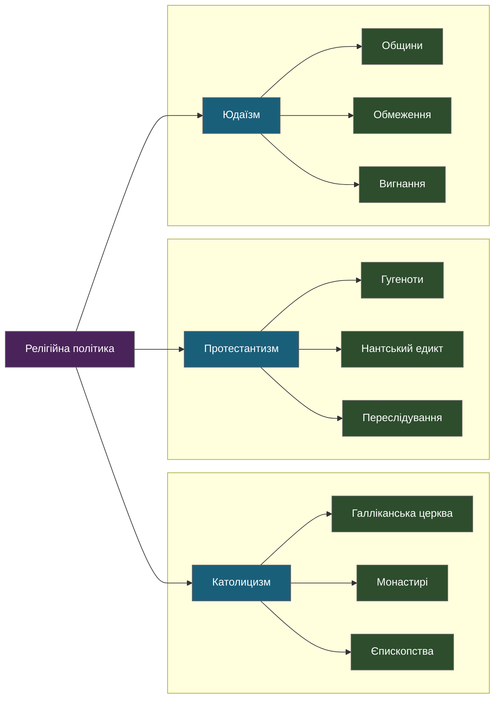

#### Хронологія релігійної політики

| **Рік** | **Подія**                    | **Значення**            | **Наслідки**        |
| ------- | ---------------------------- | ----------------------- | ------------------- |
| 1516    | Болонський конкордат         | Контроль над церквою    | Галліканізм         |
| 1598    | Нантський едикт              | Релігійна толерантність | Мир з гугенотами    |
| 1685    | Скасування Нантського едикту | Католицька єдність      | Еміграція гугенотів |

### Освітня політика

#### Розвиток освітніх інституцій

- **Університети**:
  - Сорбонна (1257)
  - Орлеанський університет (1306)
  - Монпельєський університет (1289)

- **Королівські коледжі**:
  - Коллеж де Франс (1530)
  - Єзуїтські коледжі
  - Військові академії

> "*Освіта формує не лише розум, але й душу нації*"
> — Кардинал Рішельє

### Підсумок еволюції монархічної системи

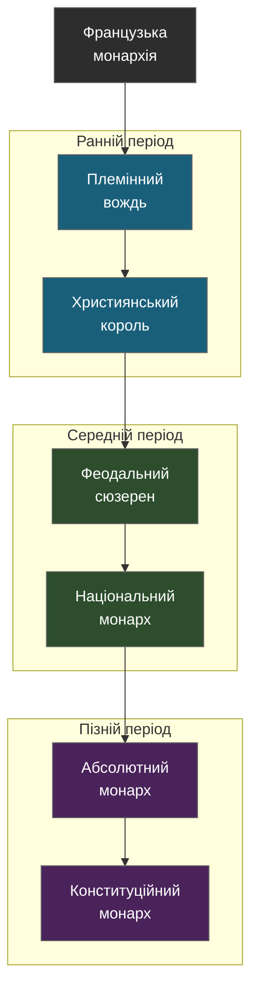

***
## **7. Вплив на культуру**

### **7.1 Література**
- **"Три мушкетери" Дюма**: Інтриги Валуа.
- **"Горбун із Нотр-Дама" Гюго**: Доба пізнього Середньовіччя.

### **Цикл "Прокляті королі" та історичний контекст**

| **Книга**                                            | **Період** | **Династія**           | **Історичний контекст**                                                                |
| ---------------------------------------------------- | ---------- | ---------------------- | -------------------------------------------------------------------------------------- |
| **"Залізний король"**                                | 1314       | Капетинги              | *Правління Філіпа IV Вродливого, суд над тамплієрами, прокляття Жака де Моле.*         |
| **"Задушена королева"** / **"В'язниця Шато-Гайяра"** | 1314-1315  | Капетинги              | *Смерть Філіпа IV, початок правління Людовика X, політична нестабільність.*            |
| **"Отрута і корона"**                                | 1315-1316  | Капетинги              | *Смерть Людовика X, вагітність королеви Клеменції, боротьба за престол.*               |
| **"Негоже ліліям прясти"**                           | 1316-1317  | Капетинги              | *Правління Філіпа V Довгого, порушення салічного закону, виключення жінок з престолу.* |
| **"Французька вовчиця"**                             | 1317-1322  | Капетинги/Плантагенети | *Ізабелла Французька, дружина Едуарда II Англійського, її змова проти чоловіка*.       |
| **"Лілія і лев"**                                    | 1322-1328  | Капетинги/Валуа        | *Смерть Карла IV, завершення династії Капетингів, початок правління Філіпа VI Валуа*.  |

#### Гі Бретон:
1. "Історії кохання в історії Франції" (10 томів):
   - Особливо важливі томи про Капетингів та Валуа
   - Розкриває особисті мотиви історичних подій
2. "Від Великих Моголів до Махараджів"
   - Паралелі між французькою та іншими монархіями

#### Інші автори:
1. Філіп Ерланже - "Генріх III"
2. Жан-Франсуа Шяппі - "Філіп Красивий"
3. Жорж Борданов - "Людовик XIV"

### **7.2 Мистецтво**
- Картини Давида: Політична пропаганда Наполеона.

### **7.3 Архітектура**
- Собор Паризької Богоматері: Епоха Капетингів.
- Версаль: Символ абсолютної монархії.

---
### **Французькі династії та ключові події**
| **Династія**  | **Роки правління**   | **Ключові події**                          |
| ------------- | -------------------- | ------------------------------------------ |
| **Меровінги** | 481–751              | Хрещення Хлодвіга, битва при Пуатьє        |
| **Каролінги** | 751–987              | Коронація Карла Великого, Верденська угода |
| **Капетинги** | 987–1328             | Посилення феодалізму, хрестові походи      |
| **Валуа**     | 1328–1589            | Столітня війна, Ренесанс                   |
| **Бурбони**   | 1589–1792, 1814–1830 | Абсолютизм, Французька революція           |
| **Бонапарти** | 1804–1815, 1852–1870 | Кодекс Наполеона, модернізація Парижа      |
***
## 8. Історична спадщина французької монархії

### 8.1 Політична спадщина

- **Централізована держава**:
  - Створення єдиної адміністративної системи
  - Формування професійної бюрократії
  - Стандартизація законодавства
- **Дипломатична традиція**:
  - Постійні дипломатичні представництва
  - Концепція державного інтересу
  - Балансу сил у міжнародних відносинах

### 8.2 Культурна спадщина

- **Архітектурні пам'ятки**:
  - Замки Луари як символ королівської влади
  - Версальський палац як взірець європейського бароко
  - Лувр як свідчення еволюції французької монархії
- **Мистецькі колекції**:
  - Королівські колекції як основа музею Лувр
  - Гобелени мануфактури Гобеленів
  - Королівські меблі та декоративне мистецтво

### 8.3 Соціальна спадщина

- **Формування національної ідентичності**:
  - Єдина французька мова
  - Спільна історична пам'ять
  - Національні символи (прапор, гімн)
- **Суспільні інституції**:
  - Система освіти
  - Академії наук та мистецтв
  - Правова система

### 8.4 Економічна спадщина

- **Розвиток інфраструктури**:
  - Мережа доріг та каналів
  - Королівські мануфактури
  - Система митниць
- **Фінансові інновації**:
  - Державний банк
  - Система державного боргу
  - Податкова система

***
## 9. Глосарій термінів

### A-D
- **Апанаж** - земельне володіння, що надавалося молодшим синам короля
- **Бальї** - королівський чиновник, що здійснював судову та адміністративну владу
- **Галліканізм** - церковно-політична доктрина про незалежність французької церкви
- **Дофін** - титул спадкоємця французького престолу

### E-H
- **Едикт** - королівський указ, що мав силу закону
- **Жуайоз** - церемоніальний меч французьких королів
- **Закон про майорат** - правило про неподільність королівського домену

### I-L
- **Інтендант** - королівський чиновник з надзвичайними повноваженнями
- **Коннетабль** - головнокомандувач королівської армії
- **Курія** - королівська рада при ранніх Капетингах
- **Літ правосуддя** - урочисте засідання парламенту в присутності короля

### M-P
- **Майордом** - управитель королівського палацу при Меровінгах
- **Орифламма** - королівський штандарт
- **Пер** - найвищий титул французької знаті
- **Прево** - королівський чиновник, що керував превотством

### Q-T
- **Регалії** - королівські права та привілеї
- **Сенешаль** - королівський чиновник у південних провінціях
- **Талья** - основний прямий податок

### U-Z
- **Узуфрукт** - право користування королівським доменом
- **Фіск** - королівська скарбниця
- **Шамбелан** - придворна посада, відповідальний за королівські покої

### Спеціальні терміни
- **Салічне право** - звід законів, що регулював престолонаслідування
- **Лез-маєсте** - образа королівської величності
- **Кур пленьєр** - урочистий королівський з'їзд

***
## Французькі та англійські монархії: зв'язки, протистояння, взаємоперетини
### Точки перетину англійських та французьких династій:

1. **Плантагенети і Капетинги**:
   - Шлюб Елеонори Аквітанської з Генріхом II
   - Англійські володіння у Франції
   - Початок Столітньої війни

2. **Валуа і Ланкастери**:
   - Претензії Едуарда III на французький престол
   - Битви при Кресі (1346) та Пуатьє (1356)
   - Договір в Бретіньї (1360)

1. **Тюдори і Валуа**:
   - Шлюб Марії Тюдор і Людовика XII
   - Дипломатичне протистояння Генріха VIII і Франциска I
   - "Поле золотої парчі" (1520)

## **1. Генеалогічні зв'язки: шлюбна дипломатія та спадкоємність престолу**

### **1.1 Роль жіночого престолонаслідування**
- У середньовічній Європі жінки рідко ставали правительками, однак їхні **династичні шлюби** відігравали критично важливу роль у зміцненні союзів між Англією та Францією.
- **Ключові постаті**:
  - **Аліенора Аквітанська (1122–1204)** – французька герцогиня, яка стала королевою Англії, одружившись із Генріхом II Плантагенетом, що принесло Англії контроль над Аквітанією.
  - **Ізабелла Французька (1295–1358)** – королева Англії, відома як "Вовчиця Франції", яка ініціювала повалення свого чоловіка Едуарда II.

---
### **1.2 Вплив салічного закону на обидві монархії**
- **Салічний закон** (Lex Salica) був прийнятий франками ще за часів Меровінгів і забороняв жінкам успадковувати престол.
- **Наслідки для Франції**:
  - Після смерті Карла IV (1328) цей закон завадив передати престол його дочці Ізабеллі, що стало однією з причин Столітньої війни.
  - Відтоді Франція суворо дотримувалася чоловічої лінії спадкоємності.
- **Наслідки для Англії**:
  - В Англії, на відміну від Франції, не було чіткої заборони на жіноче престолонаслідування, що дозволило Єлизаветі I та Вікторії піднятися на трон.

---
## **2. Культурний обмін між Францією та Англією**

### **2.1 Провансальська поезія при англійському дворі**
- Через шлюб Аліенори Аквітанської до Англії прийшла **куртуазна культура**, поезія трубадурів та ідеали лицарства.
- **Культурні впливи**:
  - Англійський королівський двір прийняв традиції придворного кохання.
  - Король Річард Левове Серце сам писав вірші окситанською мовою.
- **Вплив на літературу**:
  - Ідеї куртуазного кохання проникли в середньовічні англійські романи, зокрема в легенди про короля Артура.

---
### **2.2 Нормандський вплив на англійську архітектуру**
- Після нормандського завоювання (1066) англійська архітектура зазнала значного впливу **романського стилю**, який привезли із собою нормандці.
- **Ключові пам’ятки**:
  - **Лондонський Тауер** – зразок нормандської військової архітектури.
  - **Кентерберійський собор** – побудований у стилі романської архітектури.

---
### **2.3 Готичний стиль як спільна спадщина**
- Франція та Англія разом сприяли розвитку **готичної архітектури**, яка стала символом європейського середньовіччя.
- **Французький вплив**:
  - Собор Нотр-Дам у Парижі став зразком для англійських архітекторів.
- **Англійська адаптація**:
  - Вестмінстерське абатство стало першою англійською спорудою, зведеною за готичними канонами.

---
## **3. Військові інновації: вплив взаємних конфліктів**

### **3.1 Розвиток лицарства**
- Французькі та англійські монархи встановили нові військові стандарти, створюючи **лицарські ордени**, такі як:
  - **Орден Підв'язки** (Англія, 1348)
  - **Орден Святого Михайла** (Франція, 1469)
- **Ідеали лицарства** (куртуазність, вірність сюзерену) стали основою для взаємодії еліт.

---
### **3.2 Еволюція військової тактики**
- **Франція**:
  - Масове використання важкої кавалерії.
  - Розвиток тактики оборонних битв (битва при Азенкурі, 1415).
- **Англія**:
  - Використання довгого лука — революційна тактика, що принесла перемогу при Кресі (1346).

---
### **3.3 Замкове будівництво**
- Англія і Франція змагалися у будівництві укріплених замків:
  - **Мисливський замок Шамбор** (Франція) — палац у стилі ренесансу.
  - **Замок Дувр** (Англія) — взірець оборонного мистецтва.

---
## **4. Економічні зв'язки між Англією та Францією**

### **4.1 Торгівля вовною**
- В Англії виробництво вовни стало основою економіки, а Франція була її головним покупцем.
- **Торговельні центри**:
  - Англійська вовна постачалася у Фландрію через французькі порти.
  - Основний транзит — порт Кале (англійське володіння до 1558).

---
### **4.2 Виноробство**
- Франція традиційно постачала вино до Англії, зокрема з регіону Бордо.
- **Період англійського панування в Гасконі (1154–1453)** зробив французьке вино доступним для англійської аристократії.

---
### **4.3 Морська торгівля**
- Англія та Франція активно використовували свої порти для обміну товарами, зокрема в Ла-Манші.
- **Ключові торговельні маршрути**:
  - Вино, спеції з Франції в обмін на англійську вовну та олово.
- **Конкуренція флотів**:
  - Створення потужного англійського флоту під час Столітньої війни.

---
### **Висновок**
Французькі та англійські монархії мали глибокі взаємозв’язки, які формували європейську історію та культуру. Від генеалогічних союзів до військових інновацій і економічного співробітництва — ці дві нації впливали одна на одну протягом століть, залишивши величезну спадщину у вигляді архітектури, мистецтва та політичних систем.

#Історія #Факти

[[Велика історія англійських королівських династій - влада, війни та вплив на культуру]]
[[Геральдика. Правила, терміни та приклади]]
[[Історія республік Франції]]
[[Как различить по крестам рыцарские ордены]]
[[Коротка історія хрестових походів]]
[[Морис Дрюон - Железный король]]
[[Морис Дрюон - Лилия и лев]]
[[Морис Дрюон - Негоже лилиям прясть]]
[[Морис Дрюон - Узница Шато-Гайара]]
[[Морис Дрюон - Французская волчица]]
[[Морис Дрюон - Яд и корона]]