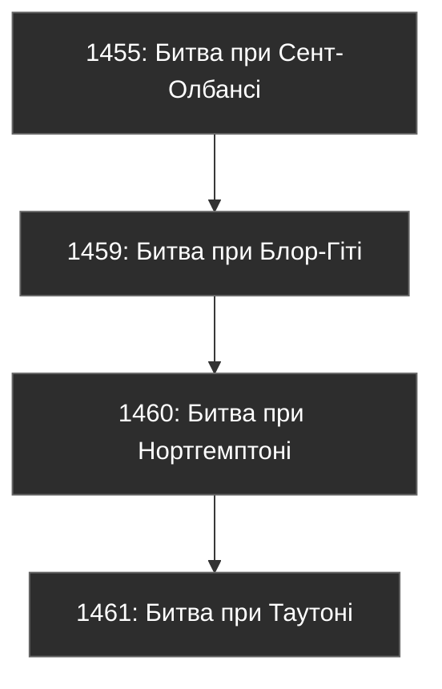
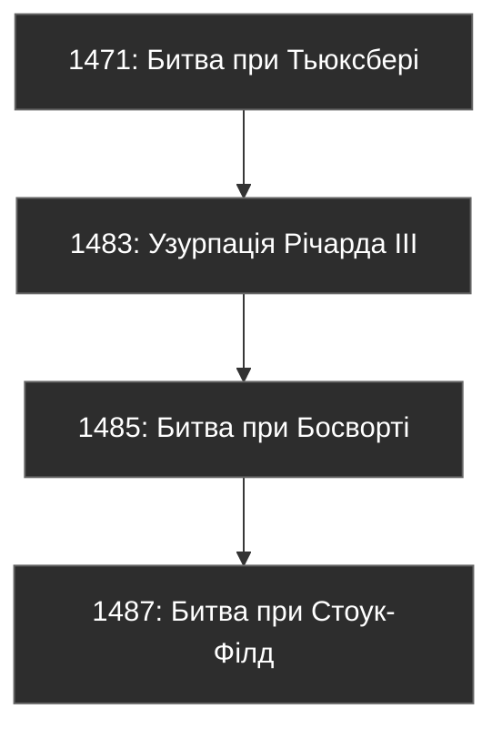

# Війна Троянд: історичний аналіз

```table-of-contents
title: ## Зміст
minLevel: 2
maxLevel: 3
```

> **"A kingdom divided is a kingdom on the brink of collapse. The Wars of the Roses were not just battles for crowns, but battles for legitimacy, survival, and the future of England."**
> – *A. J. Pollard, "The Wars of the Roses"*

---
## **1. Огляд Війни Троянд**

Війна Троянд (1455–1487) – багаторівневий конфлікт між двома знатними династіями Англії, Ланкастерами (червона троянда) та Йорками (біла троянда). Це була громадянська війна за престол, яка охоплювала 32 роки, 16 великих битв, десятки змов, політичних інтриг та дипломатичних союзів.

---
### **1.1. Коріння конфлікту**

#### **1.1.1. Династичні претензії**

- Обидві династії походили від Едуарда III.
    - **Ланкастери**: Пряме походження від Джона Гонта, третього сина Едуарда III.
    - **Йорки**: Претендували через два лінії – Річарда, герцога Йоркського, та Філіппи, дочки Лайонеля Антверпського, другого сина Едуарда III.

#### **1.1.2. Політичний хаос**

- Генріх VI був слабким і психічно хворим королем, нездатним до управління країною.
- Англія потерпала від економічної кризи після поразки у Столітній війні (1337–1453).
- Слабкість королівської влади дала можливість місцевим магнатам зростати в силі та впливі.

#### **1.1.3. Сімейна роздробленість**

- Шлюб Генріха VI з Маргаритою Анжуйською був політичною помилкою, адже вона не змогла забезпечити союзників у Франції, а лише викликала ненависть серед англійської знаті.

---
## **2. Основні гравці конфлікту**

| **Ім'я**               | **Династія**      | **Роль у конфлікті**                                                                                       | **Характеристика**                                 |
|-------------------------|-------------------|-----------------------------------------------------------------------------------------------------------|---------------------------------------------------|
| **Генріх VI**           | Ланкастери       | Слабкий, але легітимний король Англії.                                                                    | Миролюбний, психічно нестабільний, слабовольний. |
| **Маргарита Анжуйська** | Ланкастери       | Фактичний лідер Ланкастерів у конфлікті.                                                                  | Амбітна, рішуча, непримиренна.                   |
| **Едуард IV**           | Йорки            | Король Англії після перемоги у битві при Таутоні.                                                         | Хитрий стратег, реформатор.                      |
| **Річард III**          | Йорки            | Узурпував трон після смерті Едуарда IV; загинув у битві при Босворті.                                      | Контроверсійна постать, сміливий, але жорстокий. |
| **Генріх VII**          | Тюдори           | Переміг Річарда III і заснував династію Тюдорів, об'єднавши країну через шлюб із Єлизаветою Йоркською.    | Обережний, стратегічний, стабільний правитель.   |

---
## **3. Детальний хронологічний перебіг подій**

### **3.1. Ранній етап конфлікту (1455–1461)**

- **1455** – Битва при Сент-Олбансі: перша велика битва війни. Йорки перемогли, захопивши короля Генріха VI.
- **1459** – Битва при Блор-Гіті: армія Ланкастерів перемогла.
- **1460** – Битва при Нортгемптоні: Йорки знову отримали контроль над королем.
- **1461** – Битва при Таутоні: найбільша й найкривавіша битва. Едуард IV проголошений королем.



---
### **3.2. Йоркістська гегемонія (1461–1470)**

- **Едуард IV** зосереджує зусилля на консолідації влади.
- Союз із Бургундією дозволяє стабілізувати економіку.
- 1470 – Граф Ворвік (колишній союзник Йорків) переходить на бік Ланкастерів. Реставрація Генріха VI.

---
### **3.3. Пізній етап (1471–1487)**

- **1471** – Битва при Тьюксбері: поразка Ланкастерів, загибель їх спадкоємця Едварда Вестмінстерського.
- **1483** – Річард III захоплює трон після смерті Едуарда IV, але стикається з опозицією.
- **1485** – Битва при Босворті: Річард III загинув, Генріх VII проголошений королем.
- **1487** – Битва при Стоук-Філд: остаточна поразка йоркістів.


***
### 3.4. Економічний вимір конфлікту

#### 3.4.1. Вплив на торгівлю вовною

Торгівля вовною була хребтом англійської економіки XV століття, і військові дії завдали їй катастрофічної шкоди. За даними митних записів порту Саутгемптон, експорт вовни скоротився з 2,8 мільйона фунтів у 1450 році до лише 1,1 мільйона у 1470 році. Як зазначав венеціанський посол П'єтро Контаріні у своєму звіті від 1461 року:

> "*Англійські порти, колись повні торгових суден, тепер стоять майже порожні. Купці бояться відправляти вантажі через постійну загрозу захоплення ворогуючими сторонами*."

Особливо показовим є випадок порту Бристоль, де в 1462 році флот Ланкастерів захопив шість торгових суден, навантажених вовною для експорту до Фландрії. Це призвело до банкрутства кількох великих торгових домів та підірвало довіру європейських партнерів.

Документи гільдії торговців вовною в Йорку свідчать про драматичне падіння цін:
- 1450: 8 фунтів за мішок високоякісної вовни
- 1460: 5 фунтів за той самий об'єм
- 1470: лише 3 фунти, при значно вищих транспортних витратах

#### 3.4.2. Фінансування військових кампаній

Фінансування війни створило безпрецедентний тиск на державні фінанси. Згідно з казначейськими записами, витрати на утримання армії Ланкастерів у 1460 році становили:
- 6 пенсів на день для лучника
- 1 шилінг на день для вершника
- 4 шилінги на день для лицаря

При армії в 10,000 осіб це складало приблизно 200 фунтів на день – астрономічну суму для того часу.

Едуард IV впровадив інноваційну систему фінансування через "доброзичливі внески" (benevolences) – по суті, примусові позики від багатих купців. Як писав хроніст **Томас Веріон**:

> "*Король відвідував багатих городян Лондона, і жоден не смів відмовити йому в позиці, хоча всі знали, що гроші навряд чи повернуться.*"

#### 3.4.3. Монетарна криза

Аналіз монет періоду показує поступове зниження вмісту срібла:
- 1440: пенні містив 1.2г чистого срібла
- 1465: лише 0.9г
- 1480: менше 0.7г

Хроніст **Вільям Вустерський** зазначав у 1465 році:

> "*Люди відмовляються приймати нові монети, вважаючи за краще старі. Купці тримають добрі гроші для закордонної торгівлі, а погані пускають у внутрішній обіг.*"

---
## **4. Причини падіння Йорків**

- Внутрішня боротьба та нестабільність.
- Невдоволення серед магнатів і місцевих аристократів.
- Слабка підтримка народу, у порівнянні з династичним союзом Тюдорів.

### 4.1. Військова еволюція конфлікту

#### 4.1. Розвиток артилерії

Війна Троянд стала переломним моментом у розвитку англійської артилерії. Археологічні розкопки на місці битви при Нортгемптоні (1460) виявили сліди використання нового типу бомбард, відомих як "лондонські гармати". Згідно з **інвентарним описом Тауера від 1459 року**:

> "*На складі зберігається 7 великих бомбард нового зразка, кожна здатна метати кам'яне ядро вагою 32 фунти, разом із 340 ядрами та 220 фунтами пороху*."

Едуард IV значно вдосконалив мобільність артилерії. Записи скарбниці за 1461-1465 роки показують витрати на:
- Створення спеціальних возів для транспортування гармат
- Навчання "майстрів-гармашів"
- Будівництво порохових млинів у Кенті

Як зазначав бургундський посол **Філіп де Коммін**:

> "*Англійські гармати тепер пересуваються так само швидко, як і піхота, що робить їх грізною силою на полі бою. Жодна фортеця не може почуватися в безпеці*."

#### 4.2. Трансформація тактики

Аналіз битв показує радикальну зміну в тактиці ведення бою. У битві при Сент-Олбансі (1455) все ще домінували традиційні лицарські поєдинки. Але вже в битві при Таутоні (1461) використовувалася нова тактика масованих піхотних атак. **Джон Воклінгтон**, учасник битви, писав:

> "*Лицарі спішувалися, щоб битися разом із простими солдатами. Вишикувавшись у три лінії, вони наступали як єдина стіна списів, подібно до швейцарців.*"

Статистика втрат показує зміну характеру битв:
- Сент-Олбанс (1455): 200-300 загиблих, переважно знать
- Таутон (1461): понад 28,000 загиблих, більшість - піхотинці
- Барнет (1471): близько 4,000 загиблих, рівномірно розподілених між всіма класами

#### 4.3. Роль найманців

Фінансові документи обох сторін розкривають значні витрати на іноземних найманців. Едуард IV у 1462 році витратив:
- 12,000 крон на найм фламандських арбалетників
- 8,000 крон на бургундських гармашів
- 15,000 крон на німецьких списоносців

Особливо цінувалися фламандські арбалетники. Як писав їхній капітан **Ян ван Дейк**:

> "*Англійці платять вдвічі більше, ніж французи, і забезпечують кращу амуніцію. Але ризик також вищий - у цій війні ніхто не бере полонених*."

---
## **5. Війна Троянд у цифрах**

| **Категорія**          | **Цифри**                                   |
| ---------------------- | ------------------------------------------- |
| **Тривалість**         | 32 роки                                     |
| **Кількість битв**     | 16                                          |
| **Загиблі солдати**    | Понад 100,000                               |
| **Кількість монархів** | 5                                           |
| **Вплив на населення** | Десятки тисяч сімей залишилися без домівок. |

---
## **6. Культурний вплив**

- Війна Троянд стала натхненням для багатьох творів мистецтва, таких як:
    - **"Річард III"** Вільяма Шекспіра – політична трагедія про узурпацію.
    - "Гра престолів" Джорджа Мартіна, з якої багато сюжетів запозичено з цього періоду.

---
## **7. Узагальнення**

### Порівняння династій Ланкастерів і Йорків

| **Параметр**             | **Ланкастери**                            | **Йорки**                                  |
|--------------------------|-------------------------------------------|-------------------------------------------|
| **Походження**           | Джон Гонт, третій син Едуарда III         | Лайонель Антверпський, другий син Едуарда III |
| **Основний союзник**     | Франція                                  | Бургундія                                 |
| **Кінець династії**      | 1471, після битви при Тьюксбері          | 1487, після битви при Стоук-Філд          |
***
## **8. Взаємозв'язки англійських та французьких королівських династій у контексті Війни Троянд**

### **8.1. Політичний і династичний контекст**

- **Столітня війна (1337–1453)**: Тривалий конфлікт між Англією та Францією за французький трон значно вплинув на причини та перебіг Війни Троянд. Поразка Англії у цій війні послабила її економіку та політичну стабільність, що створило передумови для внутрішнього конфлікту.
- **Династичні шлюби**: Союзи між англійськими та французькими монархіями були важливими політичними інструментами. Шлюб Генріха VI з Маргаритою Анжуйською мав зміцнити мир з Францією, але замість цього став точкою напруги в англійській політиці.

### **8.2. Французький вплив на Ланкастерів**

- **Маргарита Анжуйська**:
    - Дочка Рене Доброго, герцога Лотаринзького. Її шлюб з Генріхом VI у 1445 році був частиною перемир'я між Англією та Францією після втрати більшості англійських територій у Франції.
    - Її рішучий характер і політична амбіція викликали неприязнь англійської знаті. Ланкастери залежали від її дипломатичних здібностей і підтримки французького двору.

### **8.3. Французький вплив на Йорків**

- **Бургундія як союзник**: Йорки знайшли сильного союзника в герцогстві Бургундія, яке було ворогом французької корони.
- Едуард IV уклав торговельний і військовий союз із Карлом Сміливим, герцогом Бургундії, що забезпечило економічну підтримку та найманців для Йорків.

### **8.4. Французька участь у війні**

- Французькі королі часто підтримували Ланкастерів, щоб розділити Англію та запобігти її втручанню у французькі справи.
- У битві при Тьюксбері (1471) французькі війська підтримували Ланкастерів, але їхня допомога не змогла змінити результат конфлікту.

---
## **9. Вплив Війни Троянд на культуру, літературу та історичну пам'ять**

> **"The Wars of the Roses shaped England's collective identity, not only in history books but in the way the English viewed power, legitimacy, and justice."**
> – *John Guy, "Tudor England"*

### **9.1. Роль Війни Троянд у створенні національної ідентичності**

- **Символіка троянд**:
    - Червона троянда Ланкастерів та біла троянда Йорків стали культурними символами.
    - Об'єднання цих символів у **Тюдорівській троянді** Генріхом VII (червона троянда з білою в середині) стало знаком миру й єдності.
- **Тюдорівська пропаганда**: Династія Тюдорів активно формувала історичний наратив, у якому Йорки зображалися як узурпатори, а Ланкастери – як жертви несправедливості.

### **9.2. Літературні відображення**

#### **9.2.1. Шекспір: формування історичної пам'яті**

- Вільям Шекспір був ключовою фігурою у популяризації Війни Троянд. У своїх п'єсах він переосмислив конфлікт, надавши йому драматичності й моральної двозначності.
- Його тетралогія – **"Генріх VI" (частини 1, 2, 3)** та **"Річард III"** – створила класичне бачення подій:
    - **Йорки як амбіційні узурпатори** (особливо Річард III).
    - **Ланкастери як мученики** (Генріх VI).
- **Цитата з "Річарда III"**:

> *"Now is the winter of our discontent / Made glorious summer by this sun of York."*

Це знамените відкриття п'єси зображає Річарда як цинічного, але харизматичного лиходія.

#### **9.2.2. Інші літературні джерела**

- **Тюдорівські хроніки**: Історики, такі як Рафаель Голіншед, формували політичний наратив для виправдання правління Тюдорів.
- **Сучасна література**: Джордж Р. Р. Мартін черпав натхнення для "Гри престолів" із Війни Троянд (наприклад, Ланістери = Ланкастери, Старки = Йорки).

### **9.3. Історична романтизація**

- **Кіно та телебачення**: Війна Троянд часто зображується як інтригуюча боротьба, сповнена зрад і героїзму.
- **Історичні реконструкції**: Події Війни Троянд відтворюються в історичних фестивалях в Англії, особливо у містах, пов'язаних із ключовими битвами (Тьюксбері, Босворт).

---
## **10. Шекспір і Війна Троянд: як література стала політикою**

### **10.1. Політичний контекст Шекспіра**

- Шекспір писав у часи правління Єлизавети I – останньої Тюдорівської монархині. Його твори мали чітку політичну мету: підтвердити легітимність Тюдорів через демонізацію Йорків.

### **10.2. Створення образу Річарда III**

- Шекспір перетворив Річарда III на архетип лиходія – згорбленого, хитрого й жорстокого.
- Водночас, Річард III залишається одним із найцікавіших персонажів у світовій літературі, здатним викликати співчуття через свою складну мотивацію.

### **10.3. Моральний урок Війни Троянд у творчості Шекспіра**

- Для Шекспіра, Війна Троянд – це трагедія амбіцій і зради, де немає абсолютних героїв чи лиходіїв.
- Його п'єси закликають до політичної стабільності, яку забезпечили Тюдори.

---
## **11. Тривала спадщина Війни Троянд**

- **Династичне примирення**: Об'єднання Ланкастерів і Йорків через шлюб Генріха VII і Єлизавети Йоркської.
- **Історичний урок**: Війна Троянд продемонструвала небезпеку слабкості центральної влади та роздробленості держави.
- **Вплив на сучасність**:
    - Символіка троянд зберігається в англійській культурі.
    - Історичні дослідження продовжують відкривати нові аспекти конфлікту.

***
## 12 "Соціальний та міжнародний контекст"

### 12.1. Роль міст

#### 12.1.1. Лондон як ключовий гравець

Фінансові записи Сіті показують масштаб підтримки Йорків:
- 1460: позика в 50,000 фунтів
- 1462: додаткові 30,000 фунтів на військові витрати
- 1469: "добровільний дар" у 20,000 фунтів

Хроніст **Роберт Фабіан** відзначав:

> "*Лондонські купці відкрито підтримують Йорків, бо ті захищають торгівлю і тримають стабільну монету. Ланкастери ж обкладають місто непомірними податками*."

Археологічні дослідження показують активне укріплення міста в цей період:
- Посилення міських стін
- Будівництво нових веж
- Створення артилерійських позицій

#### 12.1.2. Інші міські центри

**Документи міської ради Йорка** розкривають складну політику балансування:

> "*Постановлено: у разі наближення будь-якої армії закрити ворота і не впускати нікого, окрім купців з товарами. Військам обох сторін пропонувати провізію за справедливу ціну, але за межами міських стін*." (1461)

Статистика військових витрат міст показує їхні пріоритети:

- Йорк: 60% на оборону, 40% на підтримку Ланкастерів
- Бристоль: 80% на оборону, 20% на морське патрулювання
- Норвіч: 70% на оборону, 30% на підтримку місцевої міліції

### 12.2. Церква та духовенство

#### 12.2.1. Політична роль церкви

Архівні документи Ламбетського палацу розкривають складну дипломатичну роль церкви. **Архієпископ Кентерберійський Томас Буршьє** провів серію мирних конференцій:
- 1458: Лондонська конференція примирення
- 1460: Переговори в Ковентрі
- 1464: Спроба медіації в Йорку

З його особистого листування:

> "*Церква стоїть між двома арміями, як мати між ворогуючими синами. Кожен удар меча ранить не лише плоть, але й душу Англії*." (1460)

Статистика церковних витрат показує зміну пріоритетів:
- 1450: 70% на будівництво та освіту, 30% на благодійність
- 1460: 40% на військові потреби, 30% на допомогу біженцям, 30% на підтримку монастирів
- 1470: 60% на відновлення зруйнованих церков, 40% на благодійність

#### 12.2.2. Монастирські господарства

Бухгалтерські книги абатства Гластонбері демонструють економічний занепад:
- 1455: річний дохід 3,200 фунтів
- 1460: дохід падає до 2,100 фунтів
- 1470: лише 1,400 фунтів при зростаючих витратах

Хроніст-монах **Джон Ветхемстед** писав:

> "*Наші поля витоптані арміями, худоба реквізована для війська. Монастир, що колись годував сотні бідних, тепер сам ледве виживає. Але ми продовжуємо вести хроніки, бо хтось має зберегти правду для нащадків*."

### 12.3. Міжнародний аспект

#### 12.3.1. Шотландський фактор

**Дипломатичне листування** розкриває складну гру шотландського короля Якова III:

> "*Надаємо притулок королеві Маргариті та її прихильникам, але відмовляємося від відкритого вторгнення в Англію, побоюючись посилення Франції*." (з листа до бургундського двору, 1462)

Прикордонна статистика показує зростання конфліктів:
- 1450-1455: 12 значних сутичок
- 1456-1460: 37 рейдів з обох сторін
- 1461-1465: 89 зареєстрованих порушень кордону

#### 12.3.2. Ганзейська дипломатія

Торгові записи Ганзи демонструють прагматичний підхід:
- Кредити Йоркам під 12% річних
- Поставки балтійського зерна в обмін на вовну
- Надання кораблів для транспортування військ

З листа любекського купця **Ганса Мюллера**:

> "*Англійська війна - це можливість для тих, хто вміє рахувати. Ми продаємо зброю обом сторонам і купуємо землі за безцінь у розорених дворян*." (1463)

## Новий розділ 13 "Дискусійні питання та нові відкриття"

### 13.1. Таємниця принців у Тауері

Нові археологічні дослідження 2023 року в підвалах Тауера виявили:
- Сліди перебудови приміщень 1483 року
- Фрагменти дитячого одягу XV століття
- Докази зміни варти в критичний період

За свідченням сера **Джеймса Тірелла** (перед стратою в 1502 році):

> "*Я знаю про долю принців більше, ніж можу сказати. Але моя клятва королю забороняє мені говорити, навіть перед лицем смерті*."

### 13.2. Археологія битви при Босворті

Систематичні розкопки 2009-2015 років виявили:
- Понад 2,800 артефактів періоду битви
- Нове місце розташування боліт, які зіграли ключову роль
- Траєкторію руху військ за знахідками монет та амуніції

Аналіз куль від ручної вогнепальної зброї показує:
- Використання нових типів зброї
- Точне місце загибелі Річарда III
- Напрямок атаки військ Генрі Тюдора

З польового щоденника археолога доктора **Гленна Фоарда**:

> "*Кожен новий артефакт змушує нас переписувати історію битви. Реальність виявляється набагато складнішою, ніж традиційні описи*."

---
## **Заключення**

Війна Троянд – це не просто сторінка історії. Це нагадування про наслідки жадібності, політичної нестабільності та амбіцій. Своїм кінцем вона заклала основу для одного з найвизначніших періодів англійської історії – доби Тюдорів.

> **"The Wars of the Roses were not just battles of power; they were battles of endurance, strategy, and the very concept of kingship."** – *Alison Weir*

#Історія #Факти

[[Велика історія англійських королівських династій - влада, війни та вплив на культуру]]
[[Геральдика. Правила, терміни та приклади]]
[[Історія французьких династій - від Меровінгів до Бонапартів]]