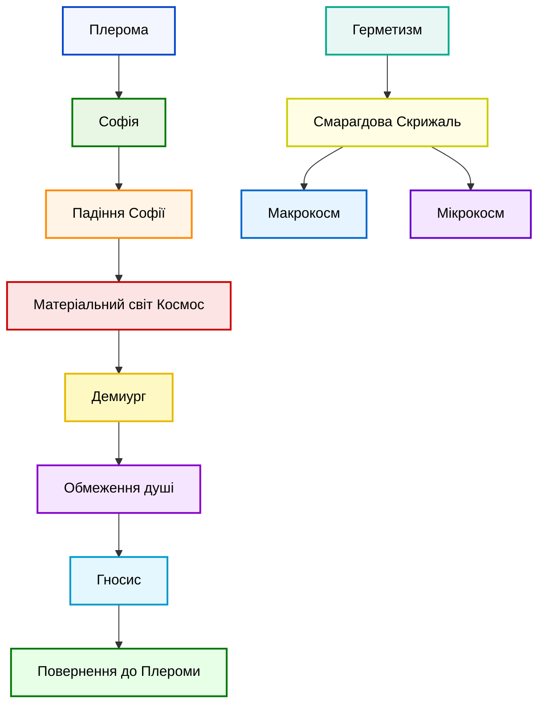

# Гностичні та герметичні традиції

```table-of-contents
title: ## Зміст
minLevel: 2
maxLevel: 3
```

---

## **Вступ**

Гностичні та герметичні традиції представляють унікальну духовну парадигму, яка поєднує філософські, містичні й релігійні ідеї. Ці традиції сформувалися на перетині елліністичної культури, єгипетських вірувань і східної думки, і стали основою для багатьох окультних і релігійних систем, включаючи алхімію та езотеричне християнство. Головна ідея цих систем — прагнення до глибокого внутрішнього знання (*гносису*), яке відкриває шлях до справжнього божественного.

---

## **Міфи та концепції**

### **Софія та Плерома**

- **Софія (Божественна Мудрість):**

Софія, уособлення мудрості, відіграє центральну роль у гностичних міфах. Її історія — це драма падіння й повернення. Софія символізує як божественну жіночність, так і пошук істини, навіть якщо він призводить до помилок. Наприклад, у деяких гностичних системах її падіння стає причиною створення матеріального світу.

  *Аналогія:* Уявіть Софію як дослідника, який занадто захопився експериментом, але цей експеримент породив нову реальність.

- **Плерома (Повнота):**

Плерома є духовним домом усіх божественних еонів. Вона нагадує бездоганну симфонію, де кожна нота — це аспект божественного. Людська душа прагне повернутися до цієї гармонії через гносис.

- **Ключові поняття:**

  - Дихотомія між духовним і матеріальним.
  - Спасіння як повернення до первинної єдності.

### **Боротьба між духом і матерією**

- **Духовна природа:** Уявіть дух як в'язня, а матерію — як в'язницю. Гностики вважали, що людська душа потрапила у матеріальний світ через дії нижчих істот, таких як Демиург.

- **Демиург:**

  - Демиург, творець матеріального світу, часто зображується як майстер, який не розуміє, що він створює. Його творіння недосконале й обмежує духовну природу.

- **Спасіння:**

  - Гносис — це як карта, що дозволяє душі втекти з цього лабіринту та знайти шлях додому, до Плероми.

---

## **Витоки гностицизму та герметизму**

### **Елліністичний Єгипет**

- **Синтез культур:**

  - Уявіть бібліотеку в Александрії, де зібрані знання з усього світу. Саме в таких умовах сформувалися гностичні та герметичні ідеї.

- **Герметичний корпус:**

  - Наприклад, "Смарагдова Скрижаль" говорить: "Що вгорі, те і внизу". Це не просто фраза, а ключ до розуміння зв'язку між макрокосмом (Всесвітом) і мікрокосмом (людиною).

### **Платонічний вплив**

- **Неоплатонізм:**
  - Плотін описує єдине як джерело всього сущого. Його ідеї надихнули гностиків на створення складних міфів про Плерому та еони.

---

## **Вплив на християнство**

### **Ранні християнські секти**

- **Валентиніани:**
  - Уявіть, що Ісус — це гість із Плероми, який приніс знання про шлях назад.

### **Тексти та апокрифи**

- **Наг-Хаммаді:**
  - Це як скарб, захований у пісках часу. Тексти Наг-Хаммаді розкривають складну структуру гностичних вірувань.

---

## **Історичний контекст та розвиток**

### **Ключові історичні постаті**

- **Гермес Трисмегіст:**
  - Він як міфічний учитель, який об'єднує філософію й магію.

### **Вплив ключових подій**

- **Собор у Нікеї (325 р.):**
  - Гностичні ідеї оголошені єретичними, але вони залишаються в езотеричних течіях.

---

## **Цікаві аспекти та спадщина**

- **Фільми та література:**
  - Уявіть "Матрицю" як сучасний гностичний міф, де Нео — це душа, яка знаходить гносис.

---

## **Діаграми та схеми**



#Історія #Факти #Міфологія

[[Архетипи в міфології - Порівняльний аналіз спільних архетипів у різних міфологічних системах]]
[[Главные египетские боги и богини]]
[[Китайська міфологія - Даоські міфи, легенди про створення світу, міфічні істоти]]
[[Космогонія та епос. Створення світу, боротьба добра і зла, апокаліпсис]]