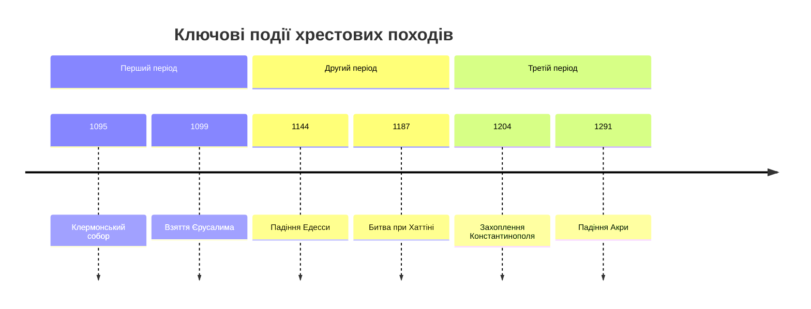
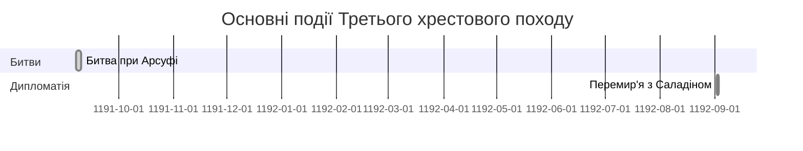
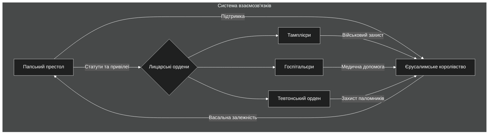
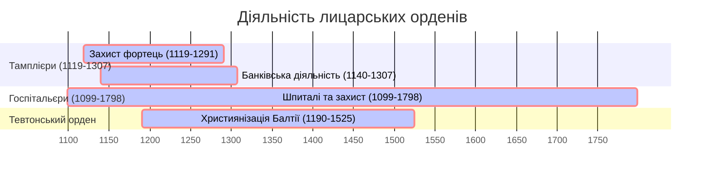
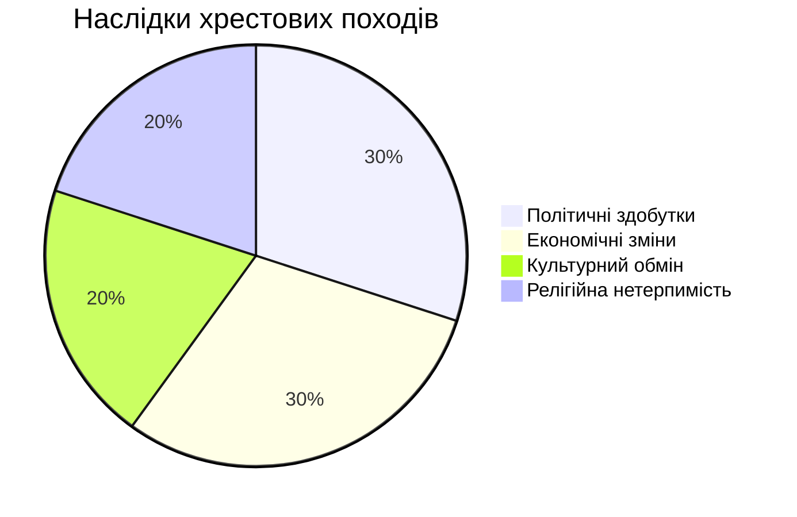

# Коротка історія хрестових походів

```table-of-contents
title: ## Зміст
minLevel: 2
maxLevel: 3
```
## **Причини та передумови хрестових походів**

### Геополітична ситуація XI століття

- Візантійська імперія під тиском сельджуків після поразки при Манцикерті (1071)
- Фрагментація мусульманського світу між Фатімідами, Аббасидами та сельджуками
- Реформаторський рух у католицькій церкві (Клюнійська реформа)

### Безпосередні каталізатори

- Прохання імператора Олексія I Комніна про військову допомогу
- Клермонська промова папи Урбана II (1095)
- Масові народні рухи під проводом Петра Пустельника

| **Категорія**  | **Причини**                                                         | **Коментарі**                                                                                                                                                                                                                                                                                               |
| -------------- | ------------------------------------------------------------------- | ----------------------------------------------------------------------------------------------------------------------------------------------------------------------------------------------------------------------------------------------------------------------------------------------------------- |
| **Релігійні**  | - Визволення Святої Землі з-під мусульманського контролю.           | Хрестові походи проголошувалися як «священні війни», підтримані обіцянками відпущення гріхів.<br>- Обіцянка відпущення гріхів включала участь у поході навіть без успішного досягнення Єрусалима.<br>- Пропаганда походів як боротьби проти "невірних" сприяла зміцненню ідентичності християнського світу. |
|                | - Захист паломників на шляху до Єрусалима.                          | Часті напади на християнських паломників створили напруження між релігіями.                                                                                                                                                                                                                                 |
| **Політичні**  | - Стабілізація Європи через відволікання уваги агресивних феодалів. | Багато феодалів отримали нові володіння, що сприяло зменшенню внутрішніх конфліктів у Європі.                                                                                                                                                                                                               |
|                | - Прагнення папства посилити свій вплив на європейську політику.    | Папа Урбан II прагнув об’єднати Європу під своїм керівництвом.                                                                                                                                                                                                                                              |
| **Економічні** | - Контроль над торговими шляхами між Європою та Сходом.             | Хрестові походи значно підвищили роль середземноморських торгових міст, таких як Венеція та Генуя.                                                                                                                                                                                                          |
|                | - Розширення територій для європейської аристократії.               | Створення християнських держав на Сході було важливим стимулом для феодалів.                                                                                                                                                                                                                                |
| **Соціальні**  | - Надія на краще життя для селян і молодших синів дворян.           | Селяни бачили в хрестових походах можливість уникнути бідності, а дворяни — можливість здобути нові землі.<br>Учасниками походів були не лише лицарі та солдати, але й ремісники, жінки та купці, які підтримували війська та займалися торгівлею на завойованих територіях.                                |

## **Ключові дійові особи хрестових походів**

| Особа                     | Роль та значення                            | Ключові досягнення/події                                         |
| ------------------------- | ------------------------------------------- | ---------------------------------------------------------------- |
| **Папа Урбан II**         | Ініціатор хрестових походів                 | Клермонська проповідь (1095), об'єднання європейських правителів |
| **Петро Пустельник**      | Лідер "народного хрестового походу"         | Зібрав велике військо селян, загинули в Малій Азії (1096)        |
| **Готфрід Бульйонський**  | Перший правитель Єрусалимського королівства | Очолив захоплення Єрусалима (1099), відмовився від титулу короля |
| **Саладін**               | Султан Єгипту та Сирії                      | Відвоював Єрусалим (1187), протистояв Річарду I                  |
| **Річард I Левове Серце** | Лідер Третього походу                       | Перемога при Арсуфі (1191), мирний договір із Саладіном          |
| **Енріко Дандоло**        | Дож Венеції                                 | Організував захоплення Константинополя (1204)                    |
| **Фрідріх II**            | Імператор Священної Римської імперії        | Дипломатичне повернення Єрусалима (1229) без бою                 |
| **Людовик IX Святий**     | Очолив 7-й і 8-й походи                     | Захоплений у полон в Єгипті (1250), загинув під час 8-го походу  |
| **Боемунд Тарентський**   | Засновник князівства Антіохійського         | Захопив Антіохію (1098), створив першу хрестоносну державу       |
| **Раймунд IV Тулузький**  | Один з лідерів Першого походу               | Заснував графство Триполі, відмовився від корони Єрусалима       |

## **Хронологія хрестових походів**

| **№**     | **Роки**    | **Ціль**                                                           | **Ключові події**                               | **Результати**                                                       |
| --------- | ----------- | ------------------------------------------------------------------ | ----------------------------------------------- | -------------------------------------------------------------------- |
| **1**     | *1096–1099* | Захоплення Єрусалима                                               | Взяття Нікеї, Антіохії, Єрусалима               | Створення християнських держав на Сході                              |
| **2**     | *1147–1149* | Захист і розширення територій хрестоносців                         | Провал облоги Дамаска                           | Втрата довіри до європейських лідерів                                |
| **3**     | *1189–1192* | Відновлення контролю над Єрусалимом після його падіння у 1187 році | Битва при Арсуфі, договір Річарда І та Саладіна | Частковий успіх, але Єрусалим залишився під мусульманським контролем |
| **4**     | *1202–1204* | Відновлення християнського впливу                                  | Захоплення та розграбування Константинополя     | Ослаблення Візантії                                                  |
| **5**     | *1217–1221* | Захоплення Єгипту                                                  | Провал облоги Дам'єтти                          | Невдача                                                              |
| **6**     | *1228–1229* | Дипломатичне повернення Єрусалима                                  | Угода імператора Фрідріха II                    | Тимчасове повернення Єрусалима під християнський контроль            |
| **7**     | *1248–1254* | Спроба відновити християнські держави                              | Кампанія Людовика IX                            | Втрата залишків територій                                            |
| **8**     | *1270*      | Остання спроба закріпити християнські позиції                      | Смерть Людовика IX                              | Кінець великих хрестових походів                                     |
| **Дітей** | *1212*      | «Невинність» дітей для звільнення Святої Землі                     | Загибель і рабство для багатьох учасників       | Символ наївності релігійного фанатизму                               |

## **Карта маршрутів хрестових походів**

```mermaid
%%{init: {'theme': 'dark', 'themeVariables': { 'primaryColor': '#2f3136', 'textColor': '#ffffff', 'lineColor': '#ffffff'}}}%%
graph LR
    subgraph Маршрути хрестових походів
    Rome((Рим)) --> |1-й похід| Const((Константинополь))
    Const --> |1-й похід| Nicea((Нікея))
    Nicea --> |1097| Antioch((Антіохія))
    Antioch --> |1098-99| Jerus((Єрусалим))
    
    Venice((Венеція)) --> |4-й похід| Zara((Зара))
    Zara --> |1204| Const
    
    France((Франція)) --> |2-й похід| Const
    Const --> Damascus((Дамаск))
    
    style Rome fill:#404040,stroke:#fff
    style Const fill:#663399,stroke:#fff
    style Jerus fill:#006400,stroke:#fff
    style Antioch fill:#800000,stroke:#fff
    end
```



---

## Ключові дати та події

| **Рік**  | **Подія**                    | **Значення**                              |
| -------- | ---------------------------- | ----------------------------------------- |
| **1095** | *Клермонський собор*         | Початок руху хрестоносців                 |
| **1099** | *Взяття Єрусалима*           | Створення християнських держав            |
| **1144** | *Падіння Едесси*             | Каталізатор Другого походу                |
| **1187** | *Битва при Хаттіні*          | Втрата Єрусалима                          |
| **1204** | *Захоплення Константинополя* | Підрив візантійської могутності           |
| **1291** | *Падіння Акри*               | Кінець присутності хрестоносців у Леванті|

---
## **Етапи хрестових походів: усі ключові кампанії**

### Перший хрестовий похід (1096–1099)

#### Підготовка та початок
- **Климат політичної ситуації:**
  - Прагнення християн відвоювати Святу землю від мусульман.
  - Західна Європа була роздроблена, однак Папа Урбан II зміг об'єднати князів.
- **Скликання походу (1095 р.):**
  - Клермонський собор: Папа Урбан II закликав до звільнення Єрусалима.
  - Обіцянки індульгенцій для учасників.
- **Рух народного хрестового походу (1096 р.):**
  - Без організації, під керівництвом Петра Пустельника.
  - Завершився катастрофою: масові вбивства та поразки в Малій Азії.

#### Основний похід
1. **Учасники:**
   - Французькі, німецькі та італійські феодали.
   - Ключові лідери: Готфрід Бульйонський, Раймунд Тулузький, Боемунд Тарентський.
2. **Маршрут:**
   - Балкани → Константинополь → Мала Азія → Сирія.
3. **Основні битви:**
   - **Нікея (1097 р.):** Хрестоносці захопили місто разом із Візантією.
   - **Антіохія (1098 р.):** Тривала облога, перемога хрестоносців.
   - **Єрусалим (1099 р.):** Захоплення міста після облоги, масова різанина.

#### Наслідки
- Створення хрестоносних держав: Єрусалимське королівство, Антіохійське князівство, графства Едеса та Триполі.
- Посилення зв'язків між Західною Європою та Сходом.
- Значні жертви серед місцевого населення.

| Назва                        | Столиця    | Дата заснування | Короткий опис                               |
| ---------------------------- | ---------- | --------------- | ------------------------------------------- |
| **Єрусалимське королівство** | *Єрусалим* | 1099            | Головна мета хрестоносців, релігійний центр |
| **Антіохійське князівство**  | *Антіохія* | 1098            | Важлива фортеця для контролю над Сирією     |

---
### Другий хрестовий похід (1147–1149)

#### Причини
- Захоплення графства Едеси мусульманами у 1144 р.
- Заклик Папи Євгенія III до нового походу.

#### Організація
- Провідні діячі: Людовик VII (Франція) та Конрад III (Німеччина).
- Маршрут через Балкани та Малу Азію.

#### Кампанії
1. **Шлях до Святого землі:**
   - Значні втрати під час переходу через Малу Азію через напади та нестачу ресурсів.
2. **Облога Дамаска (1148 р.):**
   - Невдала спроба захоплення.
   - Відсутність координації між лідерами.

#### Наслідки
- Поразка хрестоносців, падіння престижу європейських монархів.
- Посилення позицій мусульман.

---
### Третій хрестовий похід (1189–1192)

#### Причини
- Захоплення Єрусалима Саладіном у 1187 р. після битви при Хаттіні.

#### Учасники
- Провідні монархи: Річард I Левове Серце (Англія), Філіп II Август (Франція), Фрідріх I Барбаросса (Священна Римська імперія).
- Фрідріх загинув у поході, його армія розпалась.

#### Кампанії
1. **Акко (1189–1191):**
   - Захоплення міста після тривалої облоги.
2. **Битва при Арсуфі (1191):**
   - Перемога Річарда I над військами Саладіна.
3. **Невдалий штурм Єрусалима:**
   - Річард не ризикнув атакувати через нестачу ресурсів.

#### Наслідки
- Мирна угода 1192 р.:
  - Паломникам дозволено доступ до Єрусалима.
  - Єрусалим залишився під контролем мусульман.



---

### Четвертий хрестовий похід (1202-1204)

#### Підготовка та фінансування
- Початковий план: атака на Єгипет через його стратегічне значення
- Договір з Венецією про транспортування:
  - 33,500 воїнів
  - Вартість: 85,000 срібних марок
  - Флот з 200 кораблів
- Прибуло значно менше хрестоносців, ніж очікувалося (~12,000)
- Величезний борг перед Венецією

#### Відхилення від маршруту
1. **Зара (сучасний Задар)**
   - Християнське місто під контролем Угорського королівства
   - Венеціанський дож Енріко Дандоло запропонував захоплення міста в обмін на борг
   - Папа Інокентій III заборонив атаку під загрозою відлучення
   - Хрестоносці все одно захопили та пограбували місто (листопад 1202)
   - Перший випадок використання хрестоносців проти християн

2. **Константинополь**
   - Пропозиція від претендента на візантійський престол Алексія Ангела:
     - 200,000 срібних марок
     - 10,000 солдатів для походу
     - Підпорядкування православної церкви Риму
   - Перше захоплення міста (липень 1203)
   - Повстання проти відновленої династії Ангелів
   - Друге захоплення та пограбування (квітень 1204):
     - Три дні безконтрольного грабунку
     - Знищення безцінних реліквій та творів мистецтва
     - Викрадення бронзових коней з іподрому (зараз у Венеції)

#### Наслідки
- Створення Латинської імперії (1204-1261)
- Глибокий розкол між католицькою та православною церквами
- Послаблення Візантії, що полегшило майбутнє турецьке завоювання
- Збагачення Венеції:
  - Контроль над торговими шляхами
  - Захоплення численних островів та портів
  - Отримання цінних реліквій та артефактів

#### Реакція сучасників
- Папа Інокентій III засудив пограбування Константинополя
- Хроніст Нікіта Хоніат детально описав жорстокості: *"Вони поводилися гірше за варварів, розоряючи християнське місто в ім'я Христа*"
- Західні хроністи намагалися виправдати дії хрестоносців

---
### Хрестовий похід дітей (1212)

#### Легенда
- Молоді хрестоносці (згідно з літописами — діти або біднота).
- Очільники: Стефан із Франції та Ніколас із Німеччини.
- Мета: звільнити Святу землю через мир.

#### Події
- Зібрання великих натовпів без зброї.
- Багато з них потрапили в рабство або загинули в дорозі.
- Жодного військового успіху.

#### Реальність
- Історики вважають, що це були групи селян та бідних людей, а не діти.

#### Наслідки
- Похід не мав значних історичних результатів, але показав силу релігійного фанатизму.

---

## **Інші ключові кампанії**

| **Походи**                | **Роки**  | **Ключові події**                                           | **Результат**                                |
| ------------------------- | --------- | ----------------------------------------------------------- | -------------------------------------------- |
| *П'ятий хрестовий похід*  | 1217–1221 | Спроба захоплення Дам'єтти в Єгипті.                        | Провал через нездатність утримувати позиції. |
| *Шостий хрестовий похід*  | 1228–1229 | Дипломатичне повернення Єрусалима імператором Фрідріхом II. | Тимчасовий успіх для хрестоносців.           |
| *Сьомий хрестовий похід*  | 1248–1254 | Облога Дам'єтти, захоплення Людовика IX в полон в Єгипті.   | Катастрофічна поразка, величезний викуп.     |
| *Восьмий хрестовий похід* | 1270      | Кампанія Людовика IX.                                       | Закінчився смертю Людовика IX.               |

---
## **Роль лицарських орденів**

## **Військово-чернечі ордени**

### Тамплієри

## Організаційна структура

- Великий магістр
- Провінційні магістри
- Командори
- Лицарі-брати
- Сержанти
- Капелани

## Інновації

- Військова тактика
- Фінансова система
- Архітектура фортець

### Госпітальєри

## Еволюція ордену

- Від шпиталю до військової організації
- Розвиток медичної практики
- Морська стратегія

### Тевтонський орден

## Особливості

- Німецька специфіка
- Експансія в Прибалтиці
- Державотворча діяльність

### Виникнення

| **Назва**             | **Рік** | **Мета**                        | **Ключові особливості**                           |
| --------------------- | ------- | ------------------------------- | ------------------------------------------------- |
| *Орден тамплієрів*    | 1119    | Захист паломників               | Перший військовий орден, багатий і впливовий.     |
| *Орден госпітальєрів* | 1099    | Догляд за хворими та пораненими | Зберіг значення навіть після втрати Єрусалима.    |
| *Тевтонський орден*   | 1190    | Захист німецьких паломників     | Зосередився на завоюванні територій у Прибалтиці. |
### Роль у походах
- **Військова**: Забезпечували дисципліновані та професійні війська.
- **Економічна**: Організовували фінансову підтримку походів через свої багатства.
- **Релігійна**: Сприяли розширенню християнської віри.

## **Взаємозв’язки орденів**



---
### **Особливі досягнення орденів**

1. **Тамплієри**:
   - Створення системи банківської діяльності, що дозволила зберігати кошти для походів.
   - Захист ключових фортець у Святій Землі.

2. **Госпітальєри**:
   - Організація шпиталів для поранених і хворих.
   - Активна оборона на острові Родос та Мальта після втрати Єрусалима.

3. **Тевтонський орден**:
   - Зосередження на християнізації Прибалтики після невдач у Святій Землі.


---
## **Спадщина хрестових походів**

Хрестові походи стали моделлю для майбутніх колоніальних експансій, формуючи ідеологію "цивілізаційної місії".
### Військова справа

- Розвиток фортифікації
- Еволюція озброєння
- Тактичні інновації
- Логістика великих армій

### Економіка

## Торгівля

- Нові торгові маршрути
- Розвиток морських республік
- Банківська справа
- Товарообмін між культурами

## Технології

- Передача арабських знань
- Архітектурні інновації
- Розвиток картографії

#### Здобутки в науці

Хрестові походи сприяли перенесенню наукових знань зі Сходу до Західної Європи. Зокрема, завдяки контактам із мусульманським світом:

- В Європі поширилися арабські цифри, методи обчислень, праці з медицини та географії.
- Університети почали інтегрувати переклади праць Авіценни, Аль-Фарабі та інших східних мислителів.

### Культурний вплив

- Рицарська культура
- Геральдика
- Література
- Мистецтво

#### Мистецькі впливи

- Західні художники запозичили східні стилі орнаментів, техніки обробки металу та скла.
- Зростання популярності вітражів і мозаїк у готичних соборах.

### Релігійні наслідки

- Зміни в католицькій церкві
- Взаємодія з православ'ям
- Розвиток місіонерства

## Історіографія

### Середньовічні джерела

- Хроніки хрестоносців
- Арабські джерела
- Візантійські документи

### Сучасні інтерпретації

- Економічні теорії
- Культурологічні підходи
- Військово-історичний аналіз

| **Категорія**       | **Позитивні**                                                  | **Негативні**                                               |
|---------------------|---------------------------------------------------------------|------------------------------------------------------------|
| **Політичні**       | Зміцнення монархій, зменшення впливу феодалів.                | Розкол між католиками та православними після 1204 року.    |
| **Економічні**      | Розвиток торгівлі, поширення східних товарів.                 | Величезні витрати ресурсів і людських життів.             |
| **Культурні**       | Культурний обмін між Сходом і Заходом.                        | Зростання релігійної нетерпимості, переслідування євреїв.  |


<iframe title="ДИТЯЧІ ХРЕСТОВІ ПОХОДИ.РЕЛІГІЙНИЙ ФАНАТИЗМ СЕРЕДНІХ ВІКІВ.1212 рік.ПОДКАСТ." src="https://www.youtube.com/embed/MLX6FcMa4Ug?feature=oembed" height="113" width="200" style="aspect-ratio: 1.76991 / 1; width: 100%; height: 100%;" allowfullscreen="" allow="fullscreen"></iframe>

#Історія #Факти

[[Геральдика. Правила, терміни та приклади]]
[[Історія Римських імперій та Германських рейхів]]
[[Как различить по крестам рыцарские ордены]]