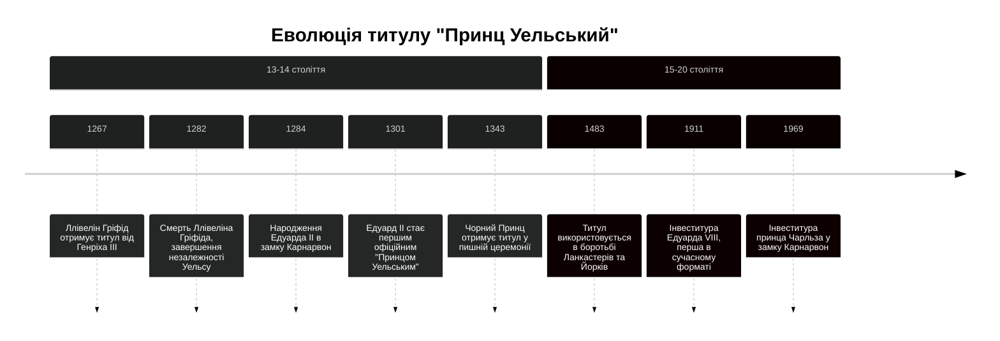

# Титул "Принц Уельський": історія та значення

```table-of-contents
title: ## Зміст
minLevel: 2
maxLevel: 3
```
## 1. Походження титулу

### 1.1. Історичний контекст

Титул "Принц Уельський" виник внаслідок драматичних подій XIII століття. До 1282 року Уельс залишався незалежним князівством під правлінням місцевої династії. Як записав хроніст **Метью Паризький**:

> "*Валлійці вважали себе істинними британцями, спадкоємцями давньої традиції, і дивилися на англійців як на прибульців та узурпаторів*."

Останнім незалежним правителем був Ллівелін ап Гріфід (помер 1282), якого валлійці називали "Ллівелін Останній". З **хроніки Аберконві**:

> "*Він тримався до кінця, як личить істинному принцу Кімру* [Уельсу], *відмовляючись схилити коліна перед англійським королем*."

### 1.2. Завоювання Уельсу

Едуард I, відомий як "Молот Валлійців", провів дві ключові кампанії:

- **1277**: Перша війна завершилася Договором в Аберконві, який тимчасово зменшив вплив валлійських князів.
- **1282–1283**: Друга кампанія призвела до смерті Ллівеліна ап Гріфіда і повного завоювання.

Архівні записи свідчать про колосальні військові витрати, зокрема:

- **1277**: 23,000 фунтів на армію.
- **1282–1283**: Понад 150,000 фунтів на будівництво замків, таких як Карнарвон і Конві.

Едуард I зміцнив своє панування через архітектурну присутність, запровадивши англійські закони і знищивши місцеву еліту.

***
## 2. Створення титулу

### 2.1. Карнарвонська угода

За легендою, **Едуард I** пообіцяв валлійцям правителя, який:
- Народився в Уельсі
- Не говорить англійською
- Є "доброчесним і справедливим"

25 квітня 1284 року в замку Карнарвон він представив їм свого новонародженого сина, майбутнього Едуарда II, кажучи:

> "*Ось ваш принц, народжений в Уельсі, який не говорить жодного слова англійською!*"

### 2.2. Офіційне затвердження

Документи показують послідовність подій:
- **1301**: Едуард II став першим офіційним "Принцом Уельським".
- **1343**: Чорний Принц отримав титул у найпишнішій церемонії інвеститури.
- **1400**: Титул був офіційно закріплений за спадкоємцем англійського престолу.

Середній вік спадкоємця при наданні титулу становив 10–15 років, що підкреслювало політичну підготовку до ролі монарха.

***
## 3. Символіка та регалії

### 3.1. Геральдичні елементи

Інвентарні описи Тауера від 1384 року згадують:
- Корону принца з хрестом і ліліями
- Перстень з валлійським драконом
- Жезл із золотим голубом

Геральдика титулу відображає змішання валлійських і англійських традицій:
- **Чотири пера страуса** (символ королівської династії).
- **Девіз "Ich Dien"** ("Я служу").
- **Валлійський дракон**, що уособлює місцеву ідентичність.

### 3.2. Замок Карнарвон

Замок Карнарвон, збудований за наказом Едуарда I, мав стати центром англійської влади. Будівельні витрати становили понад 27,000 фунтів – неймовірна сума для середньовіччя.

> "_Замок Карнарвон символізує міць англійської корони, але також є нагадуванням про опір валлійців._"

Будівельні рахунки 1283-1330 років показують:
- Витрати: 27,000 фунтів
- Використано: 1,800 каменярів
- Завезено: 95,000 тонн каменю

***
## 4. Історичні прецеденти

### 4.1. Значущі інвеститури

| **Рік** | **Принц**    | **Особливості церемонії** |
| ------- | ------------ | ------------------------- |
| 1301    | Едуард II    | Перша офіційна            |
| 1343    | Чорний Принц | Найпишніша                |
| 1911    | Едуард VIII  | Перша фотографована       |

### 4.2. Титул у війнах та династичних конфліктах

- **Війна Троянд** (1455–1487): Титул "Принц Уельський" ставав інструментом політичної боротьби між Ланкастерами та Йорками.
- **1483**: Едуард, син Річарда III, носив титул лише кілька місяців через поразку батька.

### 4.3. Сучасна роль

У XX столітті титул став символом єдності Британії:

- **1911**: Принц Едуард (майбутній Едуард VIII) отримав титул у першій сучасній інвеститурі.
- **1969**: Принц Чарльз був інвестований у замку Карнарвон.
### 4.4. Драматичні моменти

Під час Війни Троянд титул став об'єктом політичної боротьби:
- **1455**: Едуард Вестмінстерський отримує титул від Ланкастерів
- **1471**: Едуард V отримує титул від Йорків
- **1483**: Титул переходить до сина Річарда III



***
## 5. Валлійська ідентичність

### 5.1. Культурний опір

Навіть після завоювання, валлійські барди і народ продовжували шанувати своїх правителів. Як сказано в **хроніці монастиря Конві** (1300):

> "_Наші пісні та легенди продовжують жити, незважаючи на чужинське ярмо._"

### 5.2. Політичні наслідки

У сучасній політиці титул сприймається неоднозначно: для одних це – символ історичної спадщини, для інших – нагадування про завоювання.

***
## 6. Сучасні археологічні знахідки

Розкопки в Карнарвоні (2018-2022) виявили:
- Оригінальні елементи тронної зали XIII століття
- Церемоніальні артефакти періоду перших інвеститур
- Сліди валлійського опору у вигляді схованої зброї

***
## 7. Культурний вплив

### 7.1. Валлійська ідентичність

З **хроніки монастиря Конві** (1300):

> "*Хоч англійський принц і носить наш титул, наші барди все ще співають про повернення істинного правителя з крові Ллівеліна*."

### 7.2. Політичне значення

Документи Таємної ради показують еволюцію ставлення:
- **XIV століття**: інструмент підкорення
- **XV століття**: символ єдності
- **XVI століття**: традиційний титул спадкоємця

***
## 8. Цікаві факти

1. Едуард II був єдиним Принцом Уельським, який дійсно народився в Уельсі до XX століття.
2. Під час церемонії 1343 року Чорний Принц отримав корону, яка коштувала більше, ніж річний дохід середнього графства.
3. У період Війни Троянд титул тричі переходив між династіями протягом одного року (1483).
4. Замок Карнарвон будувався за зразком стін Константинополя, щоб підкреслити імперські амбіції Едуарда I.

***
## 9. Висновки

Титул "Принц Уельський" еволюціонував від символу завоювання до важливого елемента британської конституційної монархії. Його історія відображає складний шлях інтеграції Уельсу до складу британської держави та трансформацію відносин між англійською короною та валлійським народом.

> "*Цей титул – міст між двома народами, збудований не лише з каменю замків, але й з традицій, що пережили століття*."
> – Сер Джон Ллойд, валлійський історик, 1911

#Історія #Факти

[[Велика історія англійських королівських династій - влада, війни та вплив на культуру]]
[[Війна Троянд - історичний аналіз]]
[[Геральдика. Правила, терміни та приклади]]